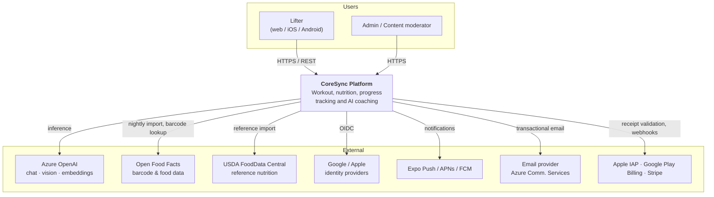
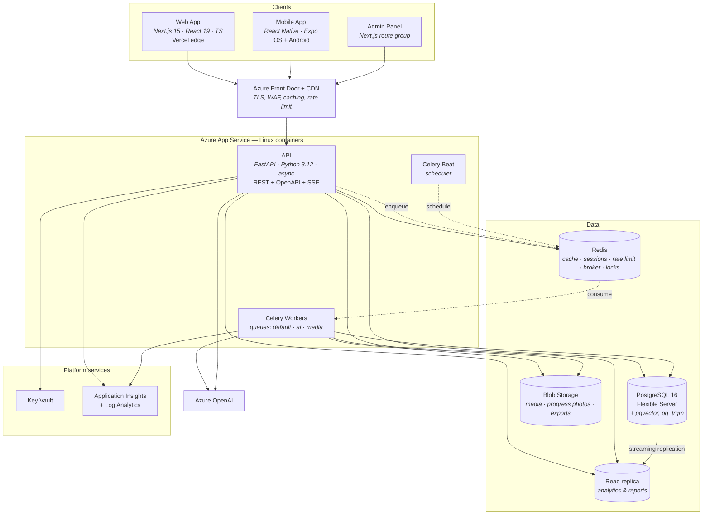
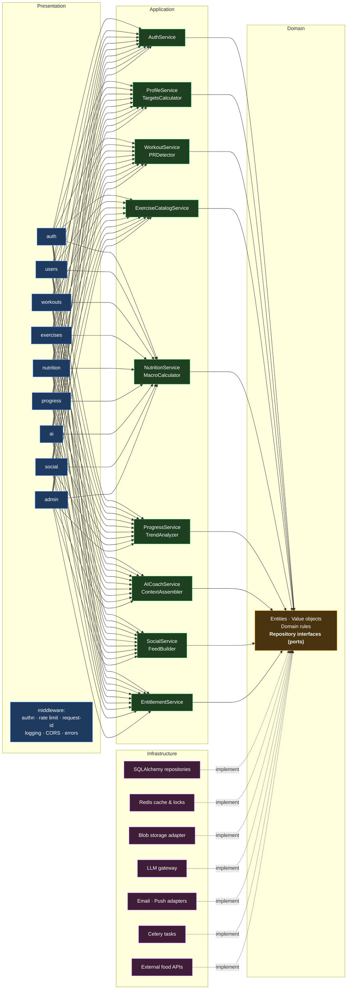
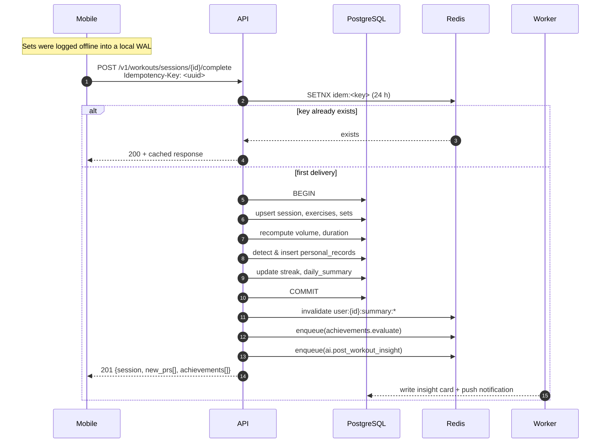
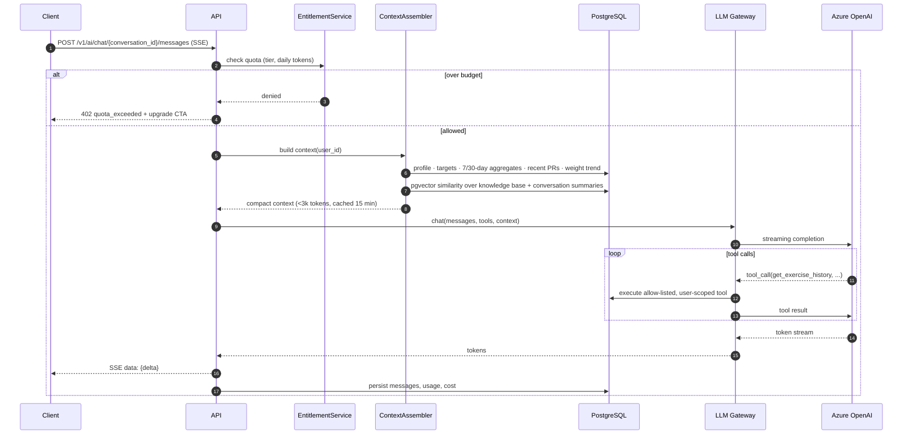
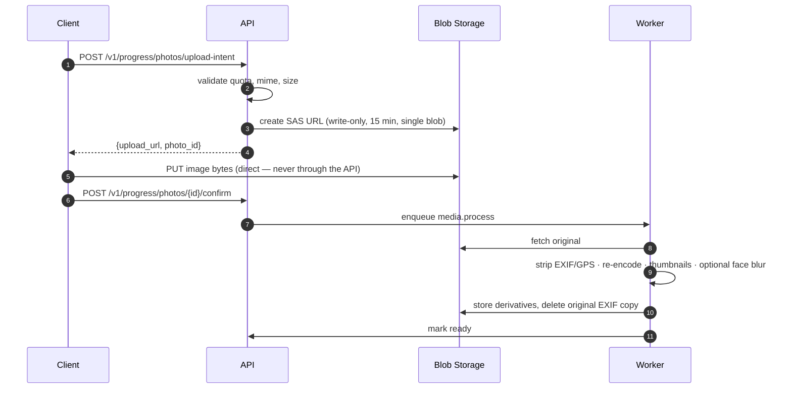
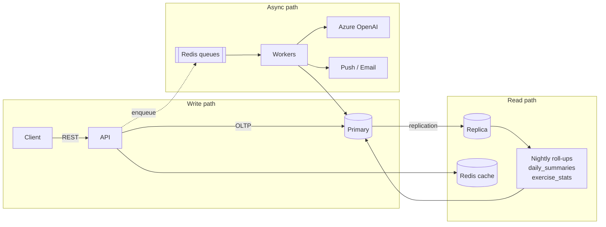

# 02 · System Architecture

## 1. Guiding principles

1. **Modular monolith, not microservices.** One deployable API with hard internal module
   boundaries. A team of 5–8 cannot operate 12 services, and the domain is not yet understood
   well enough to draw service boundaries correctly. The module boundaries defined in
   [05](05-backend-architecture.md) are the seams along which services can be extracted *later*,
   when a specific scaling or team-autonomy pressure justifies it.
2. **The database is the source of truth; everything else is a cache or a projection.**
3. **Offline-first on mobile.** The gym is an adversarial network environment. The client owns a
   write-ahead log and syncs when it can.
4. **Async by default for anything slow.** LLM calls, image processing, report generation,
   notifications and analytics roll-ups never block an HTTP request.
5. **Every expensive thing is metered and budgeted** — AI tokens, storage, egress.
6. **Stateless API instances.** All state in Postgres, Redis or Blob Storage, so horizontal
   scaling is a slider.
7. **Boring technology.** Postgres does full-text search, JSON, vectors and time-series
   aggregation well enough for the first two orders of magnitude of growth. Add Elasticsearch,
   ClickHouse or a vector DB only when a measured limit is hit — see [14](14-scalability-and-operations.md).

## 2. C4 Level 1 — System context

## 3. C4 Level 2 — Containers

### Container responsibilities

| Container | Responsibility | Scaling trigger |
|---|---|---|
| **Web App** | Marketing site, full app for desktop, admin panel. SSR for public pages, client-rendered for the authenticated app | Vercel auto |
| **Mobile App** | The primary logging surface. Offline write-ahead log + background sync | n/a |
| **API** | All business logic, authn/z, validation, orchestration. Stateless | CPU > 65 % or p95 > 400 ms |
| **Celery workers** | AI generation, image processing, reports, notifications, imports, roll-ups | Queue depth (KEDA) |
| **Celery beat** | Cron-like scheduling. **Exactly one instance**, singleton-locked | never |
| **PostgreSQL** | System of record | Storage/IOPS, then read replicas, then partitioning |
| **Redis** | Cache, rate-limit counters, distributed locks, Celery broker, SSE fan-out | Memory / ops-per-second |
| **Blob Storage** | Exercise media, progress photos, data exports | n/a |

> **Why separate queues?** `ai` tasks are slow (seconds to minutes) and cost money; `media`
> tasks are CPU/memory heavy; `default` tasks must stay snappy. One shared queue means a
> backlog of weekly reports delays every password-reset email. Separate queues scale, retry and
> fail independently.

## 4. C4 Level 3 — API modules

**The dependency rule:** arrows point inward. Domain knows nothing about SQLAlchemy, FastAPI,
Redis or Azure. Infrastructure implements interfaces the domain declares. This is what makes
the AI provider, the storage backend and even the ORM replaceable — and what makes 90 % of the
test suite run without a database.

## 5. Key request flows

### 5.1 Finishing a workout (write path with side effects)

Three things worth noting: the **idempotency key** (a phone retrying on a flaky connection must
not create two sessions), the **single transaction** (PRs and summaries are consistent with the
session or nothing is written), and the **deferred AI work** (the user sees their PR animation
immediately; the coach's comment appears seconds later).

### 5.2 AI chat (streaming read path)

The coach is **grounded by tools, not by prompt-stuffing**. The context assembler injects a
compact summary; anything more specific ("what did I bench in March?") the model fetches with a
user-scoped tool call. That keeps prompts small, cheap and accurate.

### 5.3 Progress photo upload (direct-to-storage)

Photos never transit the API — that would waste bandwidth, memory and request time on
instances that should stay small. **EXIF stripping is mandatory**: phone photos carry GPS
coordinates, and a progress photo geotagged to a home address is a serious privacy failure.

## 6. Data flow overview

**Roll-up strategy:** dashboards and charts never scan raw logs. A nightly (and on-write
incremental) job maintains `daily_nutrition_summaries`, `daily_activity_summaries` and
`exercise_statistics`. A year of charts is then a few hundred pre-aggregated rows instead of a
scan over hundreds of thousands of set and food-entry rows. See [03](03-database-schema.md) §9.

## 7. Architecture Decision Records

Condensed ADRs. Each records the decision, the reasoning, and what would make us change it.

---

### ADR-001 — Modular monolith over microservices
**Decision.** One FastAPI deployable with enforced internal module boundaries.
**Why.** Team size 5–8. Domain boundaries not yet proven. Cross-domain transactions (completing
a workout touches sessions, PRs, streaks, summaries, achievements) are trivial in one database
and painful across services. Operational cost of 12 services is a full-time job nobody has.
**Revisit when.** A single module needs independent scaling or an independent release cadence,
or team count exceeds ~3 squads. The AI module is the most likely first extraction — it has the
most distinct scaling profile (slow, expensive, bursty).

---

### ADR-002 — PostgreSQL for everything at first
**Decision.** One Postgres cluster: relational data, full-text search (`pg_trgm` + `tsvector`),
JSONB for flexible payloads, `pgvector` for AI retrieval, and time-series aggregation.
**Why.** Postgres handles all five competently to well past a million users. Each additional
datastore adds a backup story, a failover story, a consistency story and a bill.
**Revisit when.** Food search p95 exceeds 200 ms with correct indexing (→ OpenSearch), analytics
queries interfere with OLTP (→ ClickHouse / Synapse), or the vector table exceeds ~10 M rows with
unacceptable recall (→ dedicated vector store).

---

### ADR-003 — Async SQLAlchemy 2.0 + asyncpg
**Decision.** Fully async stack, `async_sessionmaker`, no sync fallback in request paths.
**Why.** The workload is I/O-bound (DB, blob, LLM). Async gives far higher concurrency per
instance. SQLAlchemy 2.0's typed API removes most of the legacy ORM footguns.
**Cost.** Every library in a request path must be async-safe; blocking calls poison the event
loop. Mitigation: a lint rule banning known-blocking clients in `presentation/` and
`application/`, and blocking work delegated to Celery or `run_in_executor`.

---

### ADR-004 — UUIDv7 primary keys
**Decision.** `uuid` PKs generated as UUIDv7 (time-ordered) in the application layer.
**Why.** Sequential integers leak business volume and enable enumeration. Random UUIDv4 destroys
B-tree locality and inflates index write amplification. UUIDv7 keeps time ordering (so inserts
append to the index) while staying unguessable. Client-generated IDs also let the offline mobile
app create records before it ever reaches the server — essential for the WAL sync model.
**Cost.** 16 bytes vs 8. Accepted.

---

### ADR-005 — Canonical metric storage, presentation-layer conversion
**Decision.** kg, cm, ml, kcal, grams in the database. `numeric`, never `float`.
**Why.** Mixed-unit storage makes every aggregation a bug waiting to happen (the Mars Climate
Orbiter problem). Floats make `SUM(calories)` drift.
**Cost.** Clients must convert. Handled once in a shared `packages/ui` utility.

---

### ADR-006 — Offline-first mobile with client-generated IDs
**Decision.** Mobile writes to a local SQLite/MMKV write-ahead log, assigns UUIDv7 ids, and
syncs with idempotency keys and last-write-wins per field with a server-authoritative clock.
**Why.** Gyms have no signal. An app that loses a set is uninstalled that day.
**Cost.** Real conflict-resolution complexity. Contained by making workout sessions
*append-mostly* and owned by exactly one user — the conflict surface is genuinely small.

---

### ADR-007 — Provider-agnostic LLM gateway
**Decision.** All model access goes through one internal `LLMGateway` port. Azure OpenAI is the
default adapter; OpenAI and Anthropic adapters implement the same interface.
**Why.** Model pricing, capability and availability move quarterly. Regional Azure OpenAI
capacity is a real constraint. Being able to route "cheap classification" to a small model and
"weekly report" to a frontier model — and to fail over between providers — is worth the one
extra layer of indirection. It also makes the AI layer testable with a fake adapter.
**Cost.** Lowest-common-denominator feature set; provider-specific features go behind explicit
capability flags.

---

### ADR-008 — Server-Sent Events for AI streaming, not WebSockets
**Decision.** SSE over HTTP for token streaming.
**Why.** One-directional server→client, works through every CDN and corporate proxy, auto-
reconnects, no separate connection lifecycle, and no sticky-session requirement on App Service.
**Revisit when.** Real-time bidirectional features appear (live coaching, multiplayer challenges).

---

### ADR-009 — Direct-to-blob uploads with short-lived SAS URLs
**Decision.** Clients upload media straight to Blob Storage; the API only issues and confirms.
**Why.** Keeps API instances small and fast; avoids double bandwidth cost; removes request-body
size limits from the equation.
**Cost.** Two round trips and an orphan-blob reaper for unconfirmed uploads.

---

### ADR-010 — Celery over FastAPI BackgroundTasks
**Decision.** All deferred work goes to Celery.
**Why.** `BackgroundTasks` runs in the web process: work is lost on deploy or crash, it competes
with request handling for CPU, and there is no retry, no scheduling, no visibility. Celery gives
durability, retries with backoff, scheduling, and independent scaling.

---

### ADR-011 — Read replica for analytics and AI context
**Decision.** Route report generation, admin analytics and AI context assembly to a replica.
**Why.** These queries are heavy and latency-tolerant; user-facing writes are neither.
**Cost.** Replication lag (typically < 1 s). Acceptable for all replica-routed workloads — never
route a read-after-write path there.

---

**Next:** [03 · Database Schema](03-database-schema.md)
