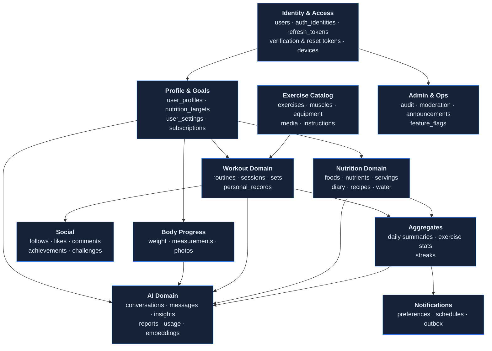
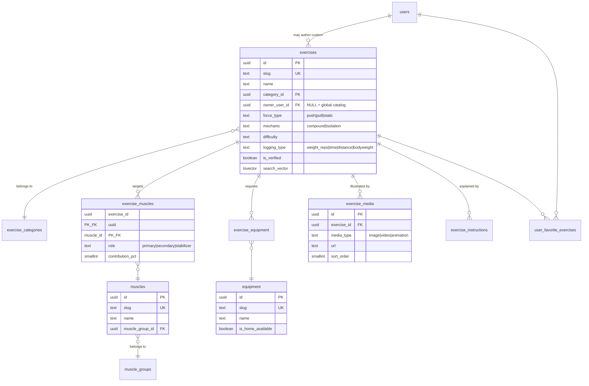
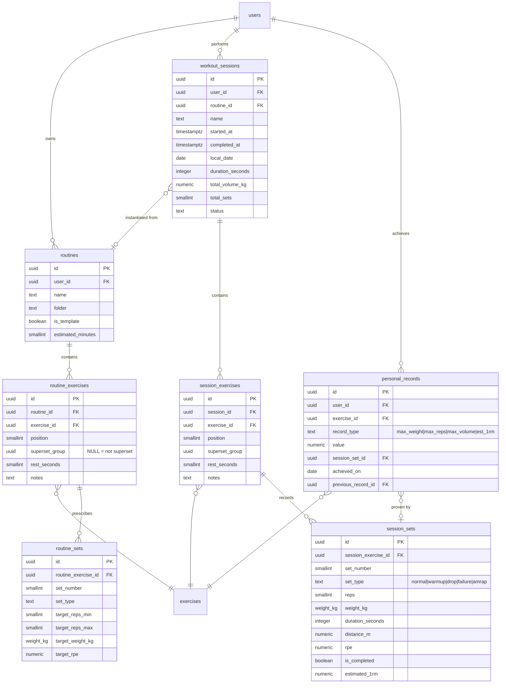
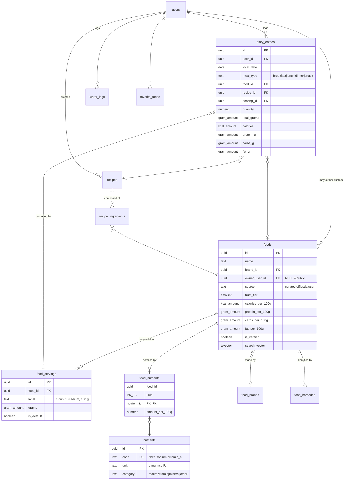
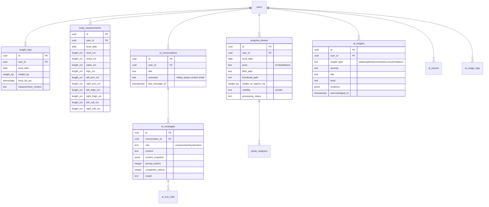

# 03 · Database Schema

PostgreSQL 16. Normalised to 3NF, with deliberate, documented denormalisation only where a
read path demands it (§9). Every relationship in the model is explained — not just drawn.

---

## 1. Conventions

| Rule | Value | Rationale |
|---|---|---|
| Primary keys | `uuid` (UUIDv7, app-generated) | Time-ordered → index locality; unguessable → safe to expose; client-generatable → offline sync (ADR-004) |
| Timestamps | `timestamptz` UTC, `created_at` / `updated_at` on every table | `updated_at` maintained by trigger, never by application code |
| User-facing days | `date` computed in the **user's** timezone at write time | A workout at 23:30 in Athens belongs to that day, not to the UTC next day |
| Soft delete | `deleted_at timestamptz NULL` on user content only | Undo, and GDPR erasure is a *hard* delete job — soft delete is not erasure |
| Money & measurements | `numeric(p,s)` | Never `float` — `SUM()` must be exact |
| Text identifiers | `citext` for email, `text` elsewhere | No `varchar(n)` guessing; enforce length with `CHECK` |
| Enumerations | `text` + `CHECK` constraint, or a lookup table | Native `ENUM` cannot have values removed and locks on `ALTER TYPE`. Lookup tables where the set is user-extensible |
| Naming | `snake_case`, plural tables, `fk_`/`ix_`/`uq_`/`ck_` prefixes on constraints | Predictable in migrations and error messages |
| Foreign keys | Always declared, `ON DELETE` explicitly chosen per relationship | An undeclared FK is a future data-integrity incident |

### Extensions

```sql
CREATE EXTENSION IF NOT EXISTS "pgcrypto";    -- gen_random_uuid fallback, digest()
CREATE EXTENSION IF NOT EXISTS "citext";      -- case-insensitive email
CREATE EXTENSION IF NOT EXISTS "pg_trgm";     -- fuzzy food & exercise search
CREATE EXTENSION IF NOT EXISTS "btree_gin";   -- composite GIN indexes
CREATE EXTENSION IF NOT EXISTS "vector";      -- pgvector, AI retrieval
CREATE EXTENSION IF NOT EXISTS "pg_stat_statements";
```

### Shared DDL primitives

```sql
-- Every table gets updated_at maintained here, so no code path can forget it.
CREATE OR REPLACE FUNCTION set_updated_at() RETURNS trigger AS $$
BEGIN
    NEW.updated_at = now();
    RETURN NEW;
END;
$$ LANGUAGE plpgsql;

-- Applied per table:
-- CREATE TRIGGER trg_<table>_updated_at BEFORE UPDATE ON <table>
--     FOR EACH ROW EXECUTE FUNCTION set_updated_at();

-- Reusable domains keep constraints consistent across 60 tables.
CREATE DOMAIN weight_kg     AS numeric(6,2) CHECK (VALUE >= 0   AND VALUE <= 1000);
CREATE DOMAIN length_cm     AS numeric(6,2) CHECK (VALUE >= 0   AND VALUE <= 300);
CREATE DOMAIN percentage    AS numeric(5,2) CHECK (VALUE >= 0   AND VALUE <= 100);
CREATE DOMAIN kcal_amount   AS numeric(8,2) CHECK (VALUE >= 0   AND VALUE <= 100000);
CREATE DOMAIN gram_amount   AS numeric(9,3) CHECK (VALUE >= 0);
CREATE DOMAIN ml_amount     AS numeric(9,2) CHECK (VALUE >= 0);
```

---

## 2. Domain map



---

## 3. Identity & Access

```mermaid
erDiagram
    users ||--o| user_profiles : "has one"
    users ||--o{ auth_identities : "may link many"
    users ||--o{ refresh_tokens : "issues"
    users ||--o{ email_verification_tokens : "requests"
    users ||--o{ password_reset_tokens : "requests"
    users ||--o{ user_devices : "registers"
    users ||--o| user_settings : "has one"
    users ||--o{ subscriptions : "holds"

    users {
        uuid id PK
        citext email UK
        text password_hash "nullable — social-only accounts"
        text role "user|moderator|admin"
        text status "pending|active|suspended|deleted"
        timestamptz email_verified_at
        text timezone
        timestamptz created_at
        timestamptz deleted_at
    }
    auth_identities {
        uuid id PK
        uuid user_id FK
        text provider "google|apple"
        text provider_subject UK
        citext provider_email
        timestamptz linked_at
    }
    refresh_tokens {
        uuid id PK
        uuid user_id FK
        bytea token_hash UK
        uuid device_id FK
        uuid replaced_by FK "rotation chain"
        timestamptz expires_at
        timestamptz revoked_at
        inet created_ip
    }
    user_devices {
        uuid id PK
        uuid user_id FK
        text platform "ios|android|web"
        text push_token
        timestamptz last_seen_at
    }
    user_settings {
        uuid user_id PK_FK
        text unit_system "metric|imperial"
        text theme "system|light|dark"
        text language
        text profile_visibility
        boolean ai_training_opt_in
    }
    subscriptions {
        uuid id PK
        uuid user_id FK
        text tier "free|pro|coach"
        text store "apple|google|stripe"
        text original_transaction_id UK
        timestamptz current_period_end
        text status
    }
```

```sql
CREATE TABLE users (
    id                  uuid PRIMARY KEY,
    email               citext NOT NULL,
    password_hash       text,                 -- NULL ⇒ social-only account
    role                text NOT NULL DEFAULT 'user'
                        CHECK (role IN ('user','moderator','admin')),
    status              text NOT NULL DEFAULT 'pending'
                        CHECK (status IN ('pending','active','suspended','deleted')),
    email_verified_at   timestamptz,
    timezone            text NOT NULL DEFAULT 'UTC',
    last_login_at       timestamptz,
    failed_login_count  smallint NOT NULL DEFAULT 0,
    locked_until        timestamptz,
    created_at          timestamptz NOT NULL DEFAULT now(),
    updated_at          timestamptz NOT NULL DEFAULT now(),
    deleted_at          timestamptz,
    CONSTRAINT ck_users_email_len CHECK (length(email) BETWEEN 3 AND 320)
);
-- Partial unique index: a hard-deleted user's email can be reused; live ones cannot collide.
CREATE UNIQUE INDEX uq_users_email_active ON users (email) WHERE deleted_at IS NULL;
CREATE INDEX ix_users_status ON users (status) WHERE deleted_at IS NULL;

CREATE TABLE auth_identities (
    id                uuid PRIMARY KEY,
    user_id           uuid NOT NULL REFERENCES users(id) ON DELETE CASCADE,
    provider          text NOT NULL CHECK (provider IN ('google','apple')),
    provider_subject  text NOT NULL,          -- the OIDC `sub`, stable forever
    provider_email    citext,
    raw_profile       jsonb NOT NULL DEFAULT '{}'::jsonb,
    linked_at         timestamptz NOT NULL DEFAULT now(),
    CONSTRAINT uq_auth_identity UNIQUE (provider, provider_subject)
);
CREATE INDEX ix_auth_identities_user ON auth_identities (user_id);

CREATE TABLE refresh_tokens (
    id            uuid PRIMARY KEY,
    user_id       uuid NOT NULL REFERENCES users(id) ON DELETE CASCADE,
    token_hash    bytea NOT NULL UNIQUE,      -- SHA-256 of the token; plaintext never stored
    device_id     uuid REFERENCES user_devices(id) ON DELETE SET NULL,
    replaced_by   uuid REFERENCES refresh_tokens(id) ON DELETE SET NULL,
    expires_at    timestamptz NOT NULL,
    revoked_at    timestamptz,
    revoked_reason text,
    created_ip    inet,
    user_agent    text,
    created_at    timestamptz NOT NULL DEFAULT now()
);
CREATE INDEX ix_refresh_tokens_user_active
    ON refresh_tokens (user_id) WHERE revoked_at IS NULL;
```

### Relationships explained

| Relationship | Card. | On delete | Why it is modelled this way |
|---|---|---|---|
| `users` → `user_profiles` | 1 : 0..1 | CASCADE | Split from `users` because the profile is large, frequently updated, and read by different code paths than authentication. Keeping `users` narrow keeps the auth hot path fast |
| `users` → `auth_identities` | 1 : N | CASCADE | One account, many login methods. A user can start with email, later link Google and Apple. `UNIQUE(provider, provider_subject)` prevents one Google account claiming two CoreSync accounts |
| `users` → `refresh_tokens` | 1 : N | CASCADE | One row per active session per device. `replaced_by` builds a rotation chain: reuse of a rotated token proves theft and triggers revocation of the whole chain ([06](06-authentication.md) §4) |
| `refresh_tokens` → `user_devices` | N : 1 | SET NULL | Lets "sign out on iPhone" revoke by device. SET NULL, not CASCADE — deleting a device must not erase the audit trail |
| `users` → `user_settings` | 1 : 0..1 | CASCADE | Vertical partition of preference data. PK *is* the FK, which enforces the 0..1 at schema level |
| `users` → `subscriptions` | 1 : N | RESTRICT | History of subscription periods, not just current state. RESTRICT because deleting a user with billing history is a financial-records decision, handled explicitly by the erasure job |

---

## 4. Profile & Goals

```mermaid
erDiagram
    users ||--o| user_profiles : ""
    users ||--o{ nutrition_targets : "versioned over time"
    users ||--o{ user_goals : "versioned over time"

    user_profiles {
        uuid user_id PK_FK
        text display_name
        date date_of_birth
        text gender
        length_cm height_cm
        text activity_level
        text experience_level
        text avatar_url
    }
    nutrition_targets {
        uuid id PK
        uuid user_id FK
        date effective_from
        date effective_to "NULL = current"
        kcal_amount calories
        gram_amount protein_g
        gram_amount carbs_g
        gram_amount fat_g
        ml_amount water_ml
        text source "auto|manual|ai"
    }
    user_goals {
        uuid id PK
        uuid user_id FK
        text goal_type "lose_fat|gain_muscle|maintain|recomp|performance"
        weight_kg target_weight_kg
        numeric weekly_rate_kg
        date target_date
        text status
    }
```

```sql
CREATE TABLE user_profiles (
    user_id           uuid PRIMARY KEY REFERENCES users(id) ON DELETE CASCADE,
    display_name      text NOT NULL,
    date_of_birth     date CHECK (date_of_birth > '1900-01-01'
                                  AND date_of_birth < current_date - interval '13 years'),
    gender            text CHECK (gender IN ('male','female','other','prefer_not_to_say')),
    height_cm         length_cm,
    activity_level    text NOT NULL DEFAULT 'moderate'
                      CHECK (activity_level IN
                            ('sedentary','light','moderate','active','very_active')),
    experience_level  text NOT NULL DEFAULT 'beginner'
                      CHECK (experience_level IN ('beginner','intermediate','advanced')),
    avatar_url        text,
    bio               text CHECK (bio IS NULL OR length(bio) <= 500),
    onboarded_at      timestamptz,
    created_at        timestamptz NOT NULL DEFAULT now(),
    updated_at        timestamptz NOT NULL DEFAULT now()
);

CREATE TABLE nutrition_targets (
    id              uuid PRIMARY KEY,
    user_id         uuid NOT NULL REFERENCES users(id) ON DELETE CASCADE,
    effective_from  date NOT NULL,
    effective_to    date,                    -- NULL = currently active
    calories        kcal_amount NOT NULL,
    protein_g       gram_amount NOT NULL,
    carbs_g         gram_amount NOT NULL,
    fat_g           gram_amount NOT NULL,
    fiber_g         gram_amount,
    water_ml        ml_amount NOT NULL DEFAULT 2500,
    source          text NOT NULL DEFAULT 'auto'
                    CHECK (source IN ('auto','manual','ai')),
    rationale       text,                    -- when source='ai', why it changed
    created_at      timestamptz NOT NULL DEFAULT now(),
    updated_at      timestamptz NOT NULL DEFAULT now(),
    CONSTRAINT ck_targets_range CHECK (effective_to IS NULL OR effective_to >= effective_from),
    -- Safety floor. The AI coach physically cannot write a dangerous target.
    CONSTRAINT ck_targets_calorie_floor CHECK (calories >= 1000)
);
-- Exactly one open-ended (current) target row per user.
CREATE UNIQUE INDEX uq_nutrition_targets_current
    ON nutrition_targets (user_id) WHERE effective_to IS NULL;
```

### Relationships explained

| Relationship | Card. | Why |
|---|---|---|
| `users` → `nutrition_targets` | 1 : N | **Temporal versioning, not mutation.** Targets change as the user's weight and goal change. Overwriting them destroys the ability to answer "was I actually in a deficit in March?" — the single most valuable question the AI coach asks. `effective_from`/`effective_to` form a non-overlapping history; the partial unique index guarantees exactly one current row |
| `users` → `user_goals` | 1 : N | Same reasoning. A user's goal history explains their body-composition history |
| `nutrition_targets.source` | — | Distinguishes auto-calculated, user-set and AI-suggested targets. Required for the AI evaluation loop and for showing the user *why* a number changed |

> **Design note — the calorie floor.** `ck_targets_calorie_floor` is a database constraint on
> purpose. Prompt instructions and service-layer validation can both be bypassed by a bug; a
> `CHECK` cannot. Eating-disorder safety is enforced at the lowest layer available. Full policy
> in [10](10-ai-architecture.md) §7.

---

## 5. Exercise Catalog



```sql
CREATE TABLE exercises (
    id             uuid PRIMARY KEY,
    slug           text NOT NULL,
    name           text NOT NULL,
    category_id    uuid NOT NULL REFERENCES exercise_categories(id) ON DELETE RESTRICT,
    owner_user_id  uuid REFERENCES users(id) ON DELETE CASCADE,  -- NULL = global catalog
    force_type     text CHECK (force_type IN ('push','pull','static')),
    mechanic       text CHECK (mechanic IN ('compound','isolation')),
    difficulty     text NOT NULL DEFAULT 'intermediate'
                   CHECK (difficulty IN ('beginner','intermediate','advanced')),
    -- Determines which set fields the UI shows and how PRs are computed.
    logging_type   text NOT NULL DEFAULT 'weight_reps'
                   CHECK (logging_type IN
                         ('weight_reps','bodyweight_reps','weighted_bodyweight',
                          'time','distance_time','reps_only')),
    is_unilateral  boolean NOT NULL DEFAULT false,
    is_verified    boolean NOT NULL DEFAULT false,
    description    text,
    search_vector  tsvector GENERATED ALWAYS AS (
                       setweight(to_tsvector('simple', coalesce(name,'')), 'A') ||
                       setweight(to_tsvector('simple', coalesce(description,'')), 'C')
                   ) STORED,
    created_at     timestamptz NOT NULL DEFAULT now(),
    updated_at     timestamptz NOT NULL DEFAULT now(),
    deleted_at     timestamptz
);
CREATE UNIQUE INDEX uq_exercises_slug_global
    ON exercises (slug) WHERE owner_user_id IS NULL;
CREATE UNIQUE INDEX uq_exercises_slug_user
    ON exercises (owner_user_id, slug) WHERE owner_user_id IS NOT NULL;
CREATE INDEX ix_exercises_search ON exercises USING GIN (search_vector);
CREATE INDEX ix_exercises_name_trgm ON exercises USING GIN (name gin_trgm_ops);
CREATE INDEX ix_exercises_catalog
    ON exercises (category_id, difficulty) WHERE owner_user_id IS NULL AND deleted_at IS NULL;

CREATE TABLE exercise_muscles (
    exercise_id      uuid NOT NULL REFERENCES exercises(id) ON DELETE CASCADE,
    muscle_id        uuid NOT NULL REFERENCES muscles(id) ON DELETE RESTRICT,
    role             text NOT NULL CHECK (role IN ('primary','secondary','stabilizer')),
    contribution_pct smallint CHECK (contribution_pct BETWEEN 0 AND 100),
    PRIMARY KEY (exercise_id, muscle_id)
);
CREATE INDEX ix_exercise_muscles_muscle ON exercise_muscles (muscle_id, role);
```

### Relationships explained

| Relationship | Card. | Why |
|---|---|---|
| `exercises` ↔ `muscles` via `exercise_muscles` | M : N | A bench press hits chest (primary), triceps and front delts (secondary), and stabilisers. The junction table carries `role` and `contribution_pct` — this is what powers per-muscle volume analytics ("you've done 34 sets of chest and 6 of rear delts this week") and the AI's balance detection. A plain M:N with no attributes could not express that |
| `muscles` → `muscle_groups` | N : 1 | Two-level hierarchy. Users think in groups ("back"); training science needs muscles ("lats", "traps", "rhomboids"). Both are needed |
| `exercises` ↔ `equipment` via `exercise_equipment` | M : N | Cable rows need a cable machine *and* an attachment. Powers "what can I do with only dumbbells at home?" — a top-5 requested filter |
| `exercises` → `exercise_media` | 1 : N | Separate table because one exercise has several images, an animation and a video, each with its own ordering, licence and CDN URL. Columns on `exercises` would be a modelling dead end |
| `exercises.owner_user_id` | self-scoping | **Single-table inheritance for custom exercises.** `NULL` = global verified catalog; non-NULL = a user's own exercise. One table means workout logging joins one table instead of a `UNION`, and custom exercises get every catalog feature for free. The two partial unique indexes keep slugs unique in the right scope |
| `exercises` ↔ `users` via `user_favorite_exercises` | M : N | Junction with `created_at` for "recently favourited" ordering |
| `exercises.logging_type` | — | Drives both UI and PR logic. A plank has no weight; a run has no reps; a weighted pull-up has both bodyweight and added load. Getting this wrong forces `NULL`-riddled set rows and broken PR maths later |

---

## 6. Workout Domain

The heart of the product.



```sql
CREATE TABLE workout_sessions (
    id                uuid PRIMARY KEY,
    user_id           uuid NOT NULL REFERENCES users(id) ON DELETE CASCADE,
    routine_id        uuid REFERENCES routines(id) ON DELETE SET NULL,
    name              text NOT NULL,
    notes             text,
    started_at        timestamptz NOT NULL,
    completed_at      timestamptz,
    -- Denormalised day in the user's timezone. Streaks, calendars and daily joins all
    -- depend on it; deriving it at query time would defeat every index.
    local_date        date NOT NULL,
    duration_seconds  integer CHECK (duration_seconds >= 0),
    -- Aggregates computed once on completion (§9).
    total_volume_kg   numeric(12,2) NOT NULL DEFAULT 0,
    total_sets        smallint NOT NULL DEFAULT 0,
    total_reps        integer NOT NULL DEFAULT 0,
    perceived_effort  smallint CHECK (perceived_effort BETWEEN 1 AND 10),
    status            text NOT NULL DEFAULT 'in_progress'
                      CHECK (status IN ('in_progress','completed','discarded')),
    visibility        text NOT NULL DEFAULT 'private'
                      CHECK (visibility IN ('private','followers','public')),
    -- Client-supplied, for offline sync deduplication.
    client_session_id uuid,
    created_at        timestamptz NOT NULL DEFAULT now(),
    updated_at        timestamptz NOT NULL DEFAULT now(),
    deleted_at        timestamptz,
    CONSTRAINT ck_session_times CHECK (completed_at IS NULL OR completed_at >= started_at)
);
CREATE INDEX ix_sessions_user_date
    ON workout_sessions (user_id, local_date DESC) WHERE deleted_at IS NULL;
CREATE UNIQUE INDEX uq_sessions_client_id
    ON workout_sessions (user_id, client_session_id) WHERE client_session_id IS NOT NULL;
-- At most one workout in progress per user — prevents duplicate sessions from a
-- double-tapped "Start workout" on a laggy connection.
CREATE UNIQUE INDEX uq_sessions_one_in_progress
    ON workout_sessions (user_id) WHERE status = 'in_progress';

CREATE TABLE session_sets (
    id                   uuid PRIMARY KEY,
    session_exercise_id  uuid NOT NULL REFERENCES session_exercises(id) ON DELETE CASCADE,
    set_number           smallint NOT NULL CHECK (set_number > 0),
    set_type             text NOT NULL DEFAULT 'normal'
                         CHECK (set_type IN ('normal','warmup','drop','failure','amrap')),
    -- Which of these are populated depends on exercises.logging_type.
    reps                 smallint CHECK (reps BETWEEN 0 AND 1000),
    weight_kg            weight_kg,
    duration_seconds     integer CHECK (duration_seconds >= 0),
    distance_m           numeric(10,2) CHECK (distance_m >= 0),
    rpe                  numeric(3,1) CHECK (rpe BETWEEN 1 AND 10),
    is_completed         boolean NOT NULL DEFAULT true,
    -- Epley formula, stored so PR queries and charts never recompute it.
    estimated_1rm        numeric(7,2) GENERATED ALWAYS AS (
                             CASE WHEN weight_kg IS NOT NULL AND reps IS NOT NULL
                                       AND reps > 0 AND reps <= 15
                                  THEN round(weight_kg * (1 + reps::numeric / 30), 2)
                             END
                         ) STORED,
    completed_at         timestamptz,
    created_at           timestamptz NOT NULL DEFAULT now(),
    updated_at           timestamptz NOT NULL DEFAULT now(),
    CONSTRAINT uq_session_set_number UNIQUE (session_exercise_id, set_number),
    -- A set must record *something*.
    CONSTRAINT ck_set_has_payload CHECK (
        reps IS NOT NULL OR duration_seconds IS NOT NULL OR distance_m IS NOT NULL
    )
);
CREATE INDEX ix_session_sets_exercise ON session_sets (session_exercise_id, set_number);

CREATE TABLE personal_records (
    id                  uuid PRIMARY KEY,
    user_id             uuid NOT NULL REFERENCES users(id) ON DELETE CASCADE,
    exercise_id         uuid NOT NULL REFERENCES exercises(id) ON DELETE CASCADE,
    record_type         text NOT NULL CHECK (record_type IN
                        ('max_weight','max_reps','max_volume_set','est_1rm',
                         'max_duration','max_distance')),
    value               numeric(12,2) NOT NULL,
    reps_at_value       smallint,
    session_set_id      uuid REFERENCES session_sets(id) ON DELETE SET NULL,
    achieved_on         date NOT NULL,
    previous_record_id  uuid REFERENCES personal_records(id) ON DELETE SET NULL,
    is_current          boolean NOT NULL DEFAULT true,
    created_at          timestamptz NOT NULL DEFAULT now()
);
-- Exactly one current record per (user, exercise, type); history is kept via the chain.
CREATE UNIQUE INDEX uq_pr_current
    ON personal_records (user_id, exercise_id, record_type) WHERE is_current;
CREATE INDEX ix_pr_user_recent ON personal_records (user_id, achieved_on DESC);
```

### Relationships explained

| Relationship | Card. | On delete | Why |
|---|---|---|---|
| `users` → `routines` | 1 : N | CASCADE | Routines are user-owned. Public/shared templates are the same table with `is_public`, copied on adoption rather than referenced — so the author editing their routine never mutates someone else's plan |
| `routines` → `routine_exercises` → `routine_sets` | 1 : N : N | CASCADE | Three levels because a routine prescribes *exercises in order*, and each prescribes *sets with targets*. Storing sets as JSON on the exercise would make "how has my prescribed volume changed?" unqueryable |
| `workout_sessions` → `routines` | N : 0..1 | **SET NULL** | A session may be freestyle (no routine), and deleting a routine must never delete workout history. This is the single most important `ON DELETE` choice in the schema — the user's training history is the irreplaceable asset |
| `workout_sessions` → `session_exercises` → `session_sets` | 1 : N : N | CASCADE | Mirrors the routine structure. Deliberately **not** the same tables: the plan and the record of what actually happened diverge constantly, and conflating them loses that difference |
| `session_exercises.superset_group` | grouping key | — | A nullable `uuid` shared by exercises performed back-to-back. Modelled as a grouping column rather than a `supersets` table because a superset has no attributes of its own — a junction table would add a join to the hottest read path for zero information |
| `session_sets.set_type` | — | — | Drop sets and warm-ups are ordinary rows with a type, not separate tables. Warm-ups are excluded from volume and PR calculations; drop sets belong to the preceding working set by `set_number` ordering |
| `personal_records` → `session_sets` | N : 0..1 | SET NULL | Every PR points at the set that proved it, so the UI can show "3 × 8 @ 100 kg on 12 March". SET NULL so a corrected/deleted set does not erase the achievement |
| `personal_records.previous_record_id` | self-ref | SET NULL | Builds a PR progression chain per exercise — "+5 kg since your last PR, 47 days ago". Also gives the AI clean progression data with no window functions over the whole set history |
| `personal_records.is_current` | — | — | Partial unique index on `is_current` means "current PRs" is an index-only lookup, while history stays intact |

> **Why `local_date` is denormalised onto sessions.** Streaks, the workout calendar and every
> "join workouts to nutrition for this day" query key on the user's local day. Computing
> `(started_at AT TIME ZONE users.timezone)::date` at query time makes the predicate
> non-sargable and forces a join to `users` on every read. One denormalised column, written once
> at insert, removes both problems. If the user changes timezone, historical rows keep the day
> that was true when they trained — which is the correct semantics.

---

## 7. Nutrition Domain



```sql
CREATE TABLE foods (
    id                  uuid PRIMARY KEY,
    name                text NOT NULL,
    brand_id            uuid REFERENCES food_brands(id) ON DELETE SET NULL,
    owner_user_id       uuid REFERENCES users(id) ON DELETE CASCADE, -- NULL = public food
    source              text NOT NULL CHECK (source IN ('curated','off','usda','user')),
    -- 1 = in-house curated, 2 = official reference (USDA), 3 = community (OFF), 4 = user.
    -- Search ranks by trust tier; the UI badges tier 1 as "Verified".
    trust_tier          smallint NOT NULL CHECK (trust_tier BETWEEN 1 AND 4),
    -- Macros denormalised onto the row: every diary read needs exactly these five numbers,
    -- and joining food_nutrients four times per entry would be absurd.
    calories_per_100g   kcal_amount NOT NULL,
    protein_per_100g    gram_amount NOT NULL DEFAULT 0,
    carbs_per_100g      gram_amount NOT NULL DEFAULT 0,
    fat_per_100g        gram_amount NOT NULL DEFAULT 0,
    is_verified         boolean NOT NULL DEFAULT false,
    is_liquid           boolean NOT NULL DEFAULT false,
    usage_count         integer NOT NULL DEFAULT 0,   -- popularity, drives search ranking
    search_vector       tsvector GENERATED ALWAYS AS (
                            setweight(to_tsvector('simple', coalesce(name,'')), 'A')
                        ) STORED,
    created_at          timestamptz NOT NULL DEFAULT now(),
    updated_at          timestamptz NOT NULL DEFAULT now(),
    deleted_at          timestamptz,
    -- Sanity: macros must roughly reconcile with calories (4/4/9 kcal per gram, ±25 %).
    CONSTRAINT ck_food_energy_sane CHECK (
        calories_per_100g = 0 OR
        abs(calories_per_100g - (protein_per_100g*4 + carbs_per_100g*4 + fat_per_100g*9))
            <= greatest(50, calories_per_100g * 0.25)
    )
);
CREATE INDEX ix_foods_search ON foods USING GIN (search_vector);
CREATE INDEX ix_foods_name_trgm ON foods USING GIN (name gin_trgm_ops);
CREATE INDEX ix_foods_ranking ON foods (trust_tier, usage_count DESC)
    WHERE deleted_at IS NULL AND owner_user_id IS NULL;

CREATE TABLE diary_entries (
    id             uuid PRIMARY KEY,
    user_id        uuid NOT NULL REFERENCES users(id) ON DELETE CASCADE,
    local_date     date NOT NULL,
    meal_type      text NOT NULL
                   CHECK (meal_type IN ('breakfast','lunch','dinner','snack')),
    food_id        uuid REFERENCES foods(id) ON DELETE RESTRICT,
    recipe_id      uuid REFERENCES recipes(id) ON DELETE RESTRICT,
    serving_id     uuid REFERENCES food_servings(id) ON DELETE SET NULL,
    quantity       numeric(9,3) NOT NULL CHECK (quantity > 0),
    total_grams    gram_amount NOT NULL,
    -- Nutrition SNAPSHOT at the moment of logging. See the design note below.
    calories       kcal_amount NOT NULL,
    protein_g      gram_amount NOT NULL,
    carbs_g        gram_amount NOT NULL,
    fat_g          gram_amount NOT NULL,
    micronutrients jsonb NOT NULL DEFAULT '{}'::jsonb,
    logged_at      timestamptz NOT NULL DEFAULT now(),
    created_at     timestamptz NOT NULL DEFAULT now(),
    updated_at     timestamptz NOT NULL DEFAULT now(),
    deleted_at     timestamptz,
    -- Exactly one of food_id / recipe_id, unless it is a quick-add (both NULL).
    CONSTRAINT ck_diary_source CHECK (num_nonnulls(food_id, recipe_id) <= 1)
);
CREATE INDEX ix_diary_user_date
    ON diary_entries (user_id, local_date DESC, meal_type) WHERE deleted_at IS NULL;
CREATE INDEX ix_diary_user_food_recent
    ON diary_entries (user_id, food_id, logged_at DESC) WHERE deleted_at IS NULL;
```

### Relationships explained

| Relationship | Card. | On delete | Why |
|---|---|---|---|
| `foods` → `food_servings` | 1 : N | CASCADE | "1 medium banana", "1 cup", "1 slice", "100 g" — each with a gram equivalent. Users log in household units; nutrition maths happens in grams. Without this table every user re-derives portions by hand and the data becomes noise |
| `foods` ↔ `nutrients` via `food_nutrients` | M : N | CASCADE / RESTRICT | Fully normalised micronutrients (~30 nutrients). Sparse and extensible: adding vitamin K is one row in `nutrients`, no migration. Kept separate from the denormalised macros because it is read on the food-detail screen, not on the diary list |
| `foods` → `food_barcodes` | 1 : N | CASCADE | One product can carry several EANs across regions and pack sizes. A `barcode` column on `foods` would be wrong from day one |
| `foods.owner_user_id` | self-scoping | CASCADE | Same single-table pattern as exercises. Custom foods stay private; they are searchable only by their owner |
| `diary_entries` → `foods` | N : 0..1 | **RESTRICT** | You cannot delete a food that people have eaten. Corrections happen via soft-delete + replacement, never by breaking history |
| `diary_entries` → `recipes` | N : 0..1 | RESTRICT | A diary entry is either a food, a recipe, or a bare quick-add of calories. Enforced by `ck_diary_source` |
| `recipes` → `recipe_ingredients` → `foods` | 1 : N : 1 | CASCADE / RESTRICT | A recipe totals its ingredients; per-serving macros are computed from `servings_count`. Ingredients reference foods so a recipe stays correct as food data is corrected |
| `users` → `water_logs` | 1 : N | CASCADE | Separate table, not a column on a daily summary: users log water in increments through the day, and the timestamps drive hydration-reminder timing |
| `users` ↔ `foods` via `favorite_foods` | M : N | CASCADE | Plus `recent foods` derived from `ix_diary_user_food_recent` — no extra table needed |

> **Design note — why diary entries snapshot their nutrition.** `diary_entries` copies calories
> and macros instead of computing them from `foods` on read. This is deliberate denormalisation
> with two justifications. **Correctness:** food data gets corrected — by moderators, by
> upstream imports, by the brand changing its recipe. If yesterday's diary recalculated from
> today's food row, a user's *history* would silently change under them, and every trend line and
> AI conclusion built on it would be wrong. A diary entry is a historical record of what was
> logged, so it stores what was true then. **Performance:** the diary and every daily total
> become a single-table read with no joins — the most frequently executed query in the product.

---

## 8. Body Progress & AI



```sql
CREATE TABLE weight_logs (
    id                  uuid PRIMARY KEY,
    user_id             uuid NOT NULL REFERENCES users(id) ON DELETE CASCADE,
    local_date          date NOT NULL,
    weight_kg           weight_kg NOT NULL,
    body_fat_pct        percentage,
    measurement_context text CHECK (measurement_context IN
                        ('morning_fasted','morning','evening','post_workout','unspecified')),
    -- Exponentially weighted moving average, maintained by the ingestion service.
    -- The trend, not the raw number, is what the user and the AI should reason about.
    trend_weight_kg     weight_kg,
    source              text NOT NULL DEFAULT 'manual'
                        CHECK (source IN ('manual','healthkit','google_fit','smart_scale')),
    note                text,
    created_at          timestamptz NOT NULL DEFAULT now(),
    updated_at          timestamptz NOT NULL DEFAULT now(),
    -- One weigh-in per day. Re-logging updates rather than appending, so the trend stays clean.
    CONSTRAINT uq_weight_per_day UNIQUE (user_id, local_date)
);
CREATE INDEX ix_weight_user_date ON weight_logs (user_id, local_date DESC);

CREATE TABLE progress_photos (
    id                    uuid PRIMARY KEY,
    user_id               uuid NOT NULL REFERENCES users(id) ON DELETE CASCADE,
    local_date            date NOT NULL,
    pose                  text NOT NULL CHECK (pose IN ('front','side','back','custom')),
    blob_path             text NOT NULL,           -- private container; served via short-lived SAS
    thumbnail_path        text,
    width                 integer,
    height                integer,
    bytes                 integer,
    weight_at_capture_kg  weight_kg,               -- snapshot: pairs the photo with the number
    -- Progress photos are the most sensitive data in the system. Private is the only
    -- default, and the CHECK makes accidental public exposure a schema error.
    visibility            text NOT NULL DEFAULT 'private'
                          CHECK (visibility IN ('private','shared_link')),
    processing_status     text NOT NULL DEFAULT 'pending'
                          CHECK (processing_status IN ('pending','processing','ready','failed')),
    exif_stripped_at      timestamptz,
    note                  text,
    created_at            timestamptz NOT NULL DEFAULT now(),
    updated_at            timestamptz NOT NULL DEFAULT now(),
    deleted_at            timestamptz
);
CREATE INDEX ix_photos_user_date
    ON progress_photos (user_id, local_date DESC, pose) WHERE deleted_at IS NULL;

CREATE TABLE ai_usage_logs (
    id                uuid PRIMARY KEY,
    user_id           uuid NOT NULL REFERENCES users(id) ON DELETE CASCADE,
    feature           text NOT NULL CHECK (feature IN
                      ('chat','weekly_report','monthly_report','plan_generation',
                       'meal_plan','photo_analysis','insight','embedding')),
    provider          text NOT NULL,
    model             text NOT NULL,
    prompt_tokens     integer NOT NULL DEFAULT 0,
    completion_tokens integer NOT NULL DEFAULT 0,
    cached_tokens     integer NOT NULL DEFAULT 0,
    cost_usd          numeric(10,6) NOT NULL DEFAULT 0,
    latency_ms        integer,
    status            text NOT NULL CHECK (status IN ('ok','error','filtered','timeout')),
    error_code        text,
    created_at        timestamptz NOT NULL DEFAULT now()
);
CREATE INDEX ix_ai_usage_user_day ON ai_usage_logs (user_id, created_at DESC);
CREATE INDEX ix_ai_usage_cost ON ai_usage_logs (created_at DESC, feature);

-- Retrieval corpus for the coach: curated fitness knowledge + rolling conversation summaries.
CREATE TABLE ai_embeddings (
    id           uuid PRIMARY KEY,
    scope        text NOT NULL CHECK (scope IN ('knowledge','user_summary','exercise','food')),
    owner_user_id uuid REFERENCES users(id) ON DELETE CASCADE,  -- NULL for global knowledge
    source_type  text NOT NULL,
    source_id    uuid,
    chunk_text   text NOT NULL,
    embedding    vector(1536) NOT NULL,
    metadata     jsonb NOT NULL DEFAULT '{}'::jsonb,
    created_at   timestamptz NOT NULL DEFAULT now()
);
CREATE INDEX ix_ai_embeddings_hnsw ON ai_embeddings
    USING hnsw (embedding vector_cosine_ops) WITH (m = 16, ef_construction = 64);
CREATE INDEX ix_ai_embeddings_scope ON ai_embeddings (scope, owner_user_id);
```

### Relationships explained

| Relationship | Card. | Why |
|---|---|---|
| `users` → `weight_logs` | 1 : N | `UNIQUE(user_id, local_date)` enforces one weigh-in per day. Multiple daily weights are noise, not signal, and they corrupt the EWMA trend |
| `users` → `body_measurements` | 1 : N | One row per measurement day with all ten sites nullable, rather than a tall `(site, value)` table. Users measure several sites at once, always read them together, and the site list is fixed — a wide row is one index lookup instead of ten |
| `users` → `progress_photos` | 1 : N | Metadata only; bytes live in Blob Storage. `weight_at_capture_kg` is snapshotted so a photo comparison can show "78.2 kg → 75.6 kg" without a temporal join |
| `progress_photos` → `photo_analyses` | 1 : N | An analysis is a separate, re-runnable artifact — models improve, prompts change, and the same photo may be analysed again. Never overwrite the photo row with model output |
| `ai_conversations` → `ai_messages` | 1 : N | Standard thread. `ai_conversations.summary` holds a rolling summary so a 200-message thread still costs ~2k context tokens |
| `ai_messages` → `ai_tool_calls` | 1 : N | Every tool invocation is recorded with its arguments and result. This is the audit trail that lets you answer "why did the coach say that?" — mandatory for a health-adjacent product |
| `users` → `ai_usage_logs` | 1 : N | Per-call token and cost metering. Drives free-tier enforcement, per-user cost dashboards and abuse detection |
| `users` → `ai_insights` | 1 : N | Insights are generated asynchronously and stored, not computed on page load. `acknowledged_at` and `evidence` (the data that justified it) make them auditable and dismissible |
| `ai_embeddings.owner_user_id` | scoping | `NULL` = global knowledge base, non-NULL = that user's private summaries. **Every retrieval query filters on this column** — a leak here means one user's data in another's coaching answer |

---

## 9. Aggregates & derived tables

Charts and dashboards never scan raw logs. These tables are maintained incrementally on write
and reconciled by a nightly job.

```sql
CREATE TABLE daily_nutrition_summaries (
    user_id        uuid NOT NULL REFERENCES users(id) ON DELETE CASCADE,
    local_date     date NOT NULL,
    calories       kcal_amount NOT NULL DEFAULT 0,
    protein_g      gram_amount NOT NULL DEFAULT 0,
    carbs_g        gram_amount NOT NULL DEFAULT 0,
    fat_g          gram_amount NOT NULL DEFAULT 0,
    fiber_g        gram_amount NOT NULL DEFAULT 0,
    water_ml       ml_amount NOT NULL DEFAULT 0,
    entry_count    smallint NOT NULL DEFAULT 0,
    target_calories kcal_amount,               -- snapshot of the target that applied that day
    is_complete    boolean NOT NULL DEFAULT false,   -- ≥3 entries: counts toward adherence
    updated_at     timestamptz NOT NULL DEFAULT now(),
    PRIMARY KEY (user_id, local_date)
);

CREATE TABLE daily_activity_summaries (
    user_id           uuid NOT NULL REFERENCES users(id) ON DELETE CASCADE,
    local_date        date NOT NULL,
    workout_count     smallint NOT NULL DEFAULT 0,
    total_volume_kg   numeric(12,2) NOT NULL DEFAULT 0,
    total_sets        smallint NOT NULL DEFAULT 0,
    duration_seconds  integer NOT NULL DEFAULT 0,
    volume_by_muscle_group jsonb NOT NULL DEFAULT '{}'::jsonb,
    pr_count          smallint NOT NULL DEFAULT 0,
    PRIMARY KEY (user_id, local_date)
);

CREATE TABLE exercise_statistics (
    user_id            uuid NOT NULL REFERENCES users(id) ON DELETE CASCADE,
    exercise_id        uuid NOT NULL REFERENCES exercises(id) ON DELETE CASCADE,
    total_sessions     integer NOT NULL DEFAULT 0,
    total_sets         integer NOT NULL DEFAULT 0,
    total_volume_kg    numeric(14,2) NOT NULL DEFAULT 0,
    best_est_1rm       numeric(7,2),
    last_performed_on  date,
    -- 8-week rolling trend, used for plateau detection without re-scanning history.
    trend_slope        numeric(8,4),
    updated_at         timestamptz NOT NULL DEFAULT now(),
    PRIMARY KEY (user_id, exercise_id)
);

CREATE TABLE user_streaks (
    user_id             uuid PRIMARY KEY REFERENCES users(id) ON DELETE CASCADE,
    workout_current     smallint NOT NULL DEFAULT 0,
    workout_longest     smallint NOT NULL DEFAULT 0,
    workout_last_date   date,
    nutrition_current   smallint NOT NULL DEFAULT 0,
    nutrition_longest   smallint NOT NULL DEFAULT 0,
    nutrition_last_date date,
    updated_at          timestamptz NOT NULL DEFAULT now()
);
```

**Why these are tables and not views.** A materialised view refreshes wholesale — at a million
users that is minutes of work to serve one user's dashboard. These tables are updated
incrementally in the same transaction as the write that changes them, so a dashboard read is a
primary-key lookup. The nightly reconciliation job exists to repair drift, not to build the data.

**Consistency rule:** the summary tables are derivable from raw data at any time. A
`reconcile_summaries(user_id, date_range)` task is the recovery path, and it runs in CI against
seeded data to prove the incremental and batch paths agree.

---

## 10. Social, notifications & admin

Condensed — the patterns repeat.

| Table | Key columns | Relationships & notes |
|---|---|---|
| `follows` | `(follower_id, followee_id)` PK, `status` | Self-referencing M:N on `users`. `status` supports private accounts (`pending` → `accepted`). `CHECK (follower_id <> followee_id)` |
| `workout_likes` | `(user_id, session_id)` PK | Junction; count denormalised onto `workout_sessions.like_count` and updated by trigger — feeds must not `COUNT(*)` |
| `workout_comments` | `id`, `session_id`, `user_id`, `parent_id` | Self-referencing for one level of replies. Moderation via `moderation_reports` |
| `achievements` | `id`, `code` UK, `criteria` jsonb, `tier` | Definition table, seeded. Criteria evaluated by a worker after each session |
| `user_achievements` | `(user_id, achievement_id)` PK, `unlocked_at`, `progress` | Junction with progress so "7 of 10 workouts" can render |
| `challenges` / `challenge_participants` | `id`, `type`, `metric`, date range / `(challenge_id, user_id)` PK, `score`, `rank` | Rank recomputed by a scheduled job into the participant row; leaderboards read it directly |
| `notification_preferences` | `user_id` PK, per-type booleans, `quiet_hours_start/end`, `timezone` | 1:0..1 with `users` |
| `notification_schedules` | `id`, `user_id`, `type`, `cron_local`, `next_run_at` | Beat scans `next_run_at` — a single indexed query finds everything due, regardless of user count |
| `notifications_outbox` | `id`, `user_id`, `channel`, `payload`, `status`, `attempts`, `dedupe_key` | **Transactional outbox.** Written in the same transaction as the domain change, delivered by a worker with retries. Guarantees a push is never lost by a crash, and `dedupe_key` guarantees it is never sent twice |
| `admin_audit_logs` | `id`, `actor_user_id`, `action`, `target_type`, `target_id`, `before`/`after` jsonb, `ip` | Append-only. Every privileged action. Retained 2 years |
| `moderation_reports` | `id`, `reporter_id`, `target_type`, `target_id`, `reason`, `status`, `resolved_by` | Polymorphic target (type + id, no FK) because it covers foods, comments, users and photos |
| `announcements` | `id`, `title`, `body`, `audience`, `starts_at`, `ends_at` | Cached in Redis; read on app launch |
| `feature_flags` | `key` PK, `enabled`, `rollout_pct`, `rules` jsonb | Percentage rollout by hashing `user_id` — deterministic and stable per user |

> **Polymorphic references** (`moderation_reports`, `notifications_outbox`) deliberately have no
> foreign key. This is the one place where referential integrity is traded away, because the
> alternative — one report table per target type — multiplies the moderation code path by five.
> The trade is contained: these tables are append-only and never join in a hot path.

---

## 11. Indexing strategy

Every index below exists to serve a specific named query. Indexes without a query are removed.

| Query | Index | Type |
|---|---|---|
| Login by email | `uq_users_email_active` | partial B-tree |
| Social login | `uq_auth_identity (provider, provider_subject)` | B-tree |
| Refresh rotation | `refresh_tokens.token_hash` UK | B-tree |
| Workout history / calendar | `ix_sessions_user_date (user_id, local_date DESC)` | partial B-tree |
| "Do I have a workout running?" | `uq_sessions_one_in_progress` | partial unique |
| Sets of a session | `ix_session_sets_exercise` | B-tree |
| Current PRs | `uq_pr_current` | partial unique |
| Food typeahead | `ix_foods_name_trgm` + `ix_foods_search` | GIN (trigram + FTS) |
| Food ranking | `ix_foods_ranking (trust_tier, usage_count DESC)` | partial B-tree |
| Diary for a day | `ix_diary_user_date (user_id, local_date DESC, meal_type)` | partial B-tree |
| Recent/frequent foods | `ix_diary_user_food_recent` | B-tree |
| Weight chart | `ix_weight_user_date` | B-tree |
| AI retrieval | `ix_ai_embeddings_hnsw` | HNSW (cosine) |
| Notification dispatch | `ix_outbox_pending (status, next_attempt_at)` | partial B-tree |
| Feed | `ix_sessions_public (visibility, completed_at DESC)` | partial B-tree |

Rules applied throughout:

- **Partial indexes for soft-deleted tables.** `WHERE deleted_at IS NULL` keeps the index the
  size of live data, which is what every query actually filters on.
- **Column order = equality columns first, then range/sort.** `(user_id, local_date DESC)` and
  never the reverse.
- **Covering indexes (`INCLUDE`)** on the two hottest reads (diary day, session sets) once
  measured — index-only scans matter at this row count.
- Every index is justified in the migration that creates it, and `pg_stat_user_indexes` is
  reviewed quarterly to drop the ones nothing uses.

---

## 12. Partitioning & retention

Not needed on day one. Needed by roughly 200k active users, and retrofitting is painful — so the
tables that will need it are designed partition-ready now (partition key present in the PK).

| Table | Strategy | Trigger |
|---|---|---|
| `session_sets` | RANGE monthly on `created_at` | > 100 M rows |
| `diary_entries` | RANGE monthly on `local_date` | > 100 M rows |
| `ai_messages` | RANGE monthly on `created_at` | > 20 M rows |
| `ai_usage_logs` | RANGE monthly, drop after 13 months | immediately at scale |
| `admin_audit_logs` | RANGE quarterly, archive to Blob after 2 years | compliance |

```sql
-- Example target shape, applied at the migration that introduces partitioning.
CREATE TABLE diary_entries (
    ...
    PRIMARY KEY (id, local_date)      -- partition key must be in the PK
) PARTITION BY RANGE (local_date);

CREATE TABLE diary_entries_2026_07 PARTITION OF diary_entries
    FOR VALUES FROM ('2026-07-01') TO ('2026-08-01');
```

`pg_partman` creates partitions ahead of time; a scheduled job detaches and archives old ones.

**Retention policy**

| Data | Retention | Notes |
|---|---|---|
| Workout, nutrition, body data | Life of account | The user's asset. Never expire |
| Progress photos | Life of account | Deleted within 30 days of account deletion |
| `ai_messages` | 24 months | Then summarised and purged |
| `ai_usage_logs` | 13 months | Billing/analytics window |
| `refresh_tokens` (revoked) | 90 days | Then purged |
| `admin_audit_logs` | 24 months hot, then archived | |
| Deleted accounts | 30-day grace, then hard erasure | See [11](11-security.md) §8 |

---

## 13. Migrations

**Alembic, with these rules:**

1. **Every migration is reversible** or documents explicitly why it is not.
2. **No migration blocks writes.** `CREATE INDEX CONCURRENTLY`, `ALTER TABLE ... ADD COLUMN`
   with a default only on PG 11+ semantics, `NOT NULL` added via `CHECK NOT VALID` → `VALIDATE`.
3. **Expand / migrate / contract for every breaking change.** Add the new column, dual-write,
   backfill in batches, switch reads, drop the old column — four deploys, zero downtime.
4. **Data migrations are Celery tasks, not Alembic scripts.** A migration that has to update 50 M
   rows must be resumable, throttled and observable; Alembic is none of those.
5. **Migrations run as a pre-deploy step** in the pipeline, against a single instance, with a
   lock. Never on application startup — that races across replicas.
6. **The autogenerated diff is a draft.** Every migration is reviewed by hand.

---

## 14. Full table inventory

| # | Domain | Tables |
|---|---|---|
| 1 | Identity | `users`, `auth_identities`, `refresh_tokens`, `email_verification_tokens`, `password_reset_tokens`, `user_devices`, `user_settings`, `subscriptions` |
| 2 | Profile | `user_profiles`, `nutrition_targets`, `user_goals` |
| 3 | Catalog | `exercise_categories`, `muscle_groups`, `muscles`, `equipment`, `exercises`, `exercise_muscles`, `exercise_equipment`, `exercise_media`, `exercise_instructions`, `user_favorite_exercises` |
| 4 | Workouts | `routines`, `routine_exercises`, `routine_sets`, `workout_sessions`, `session_exercises`, `session_sets`, `personal_records` |
| 5 | Nutrition | `food_brands`, `foods`, `food_servings`, `nutrients`, `food_nutrients`, `food_barcodes`, `favorite_foods`, `recipes`, `recipe_ingredients`, `diary_entries`, `water_logs` |
| 6 | Body | `weight_logs`, `body_measurements`, `progress_photos`, `photo_analyses` |
| 7 | AI | `ai_conversations`, `ai_messages`, `ai_tool_calls`, `ai_insights`, `ai_reports`, `ai_usage_logs`, `ai_embeddings`, `ai_generated_plans` |
| 8 | Social | `follows`, `workout_likes`, `workout_comments`, `achievements`, `user_achievements`, `challenges`, `challenge_participants` |
| 9 | Notifications | `notification_preferences`, `notification_schedules`, `notifications_outbox` |
| 10 | Admin | `admin_audit_logs`, `moderation_reports`, `announcements`, `feature_flags` |
| 11 | Aggregates | `daily_nutrition_summaries`, `daily_activity_summaries`, `exercise_statistics`, `user_streaks` |

**61 tables.** Every one is reachable from `users` by foreign key, except the seeded reference
tables (`nutrients`, `muscles`, `equipment`, `achievements`, `feature_flags`) and the
polymorphic pair noted in §10.

---

**Next:** [04 · API Design](04-api-design.md)
