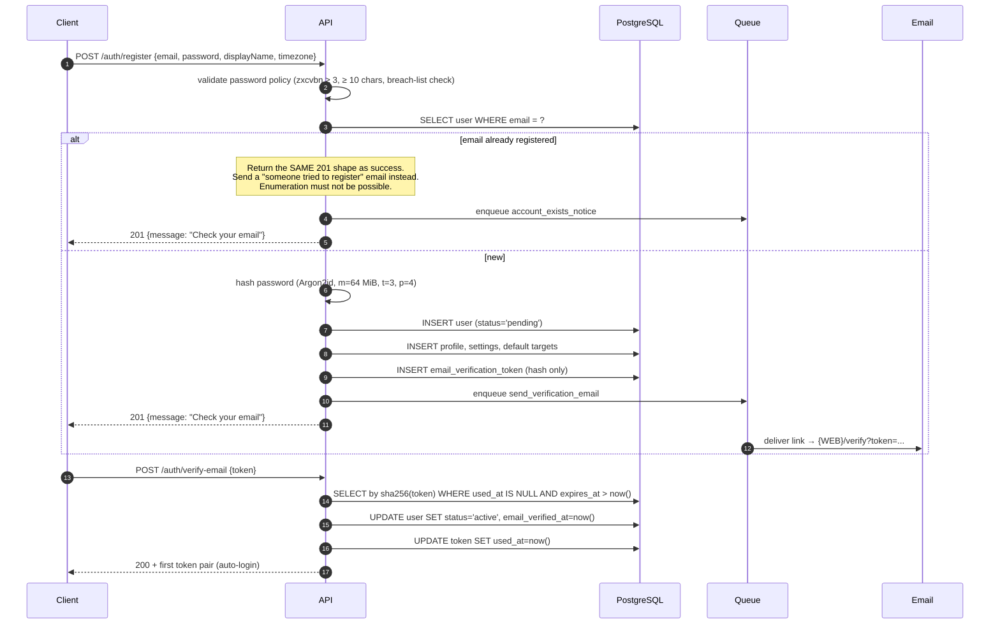
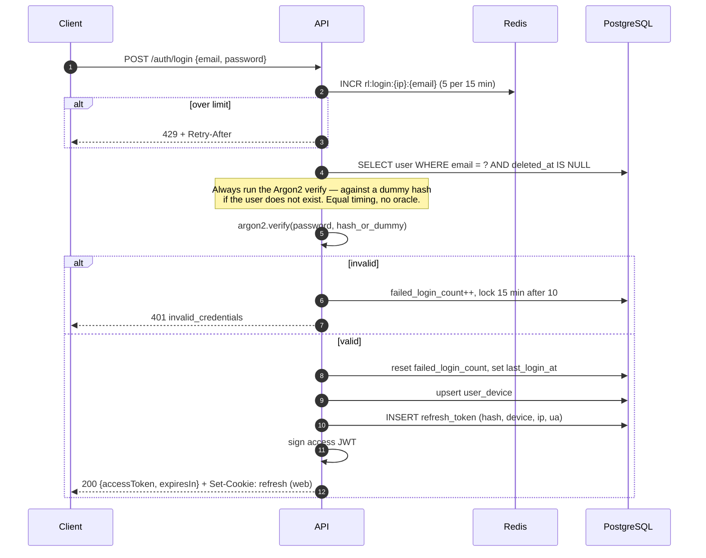
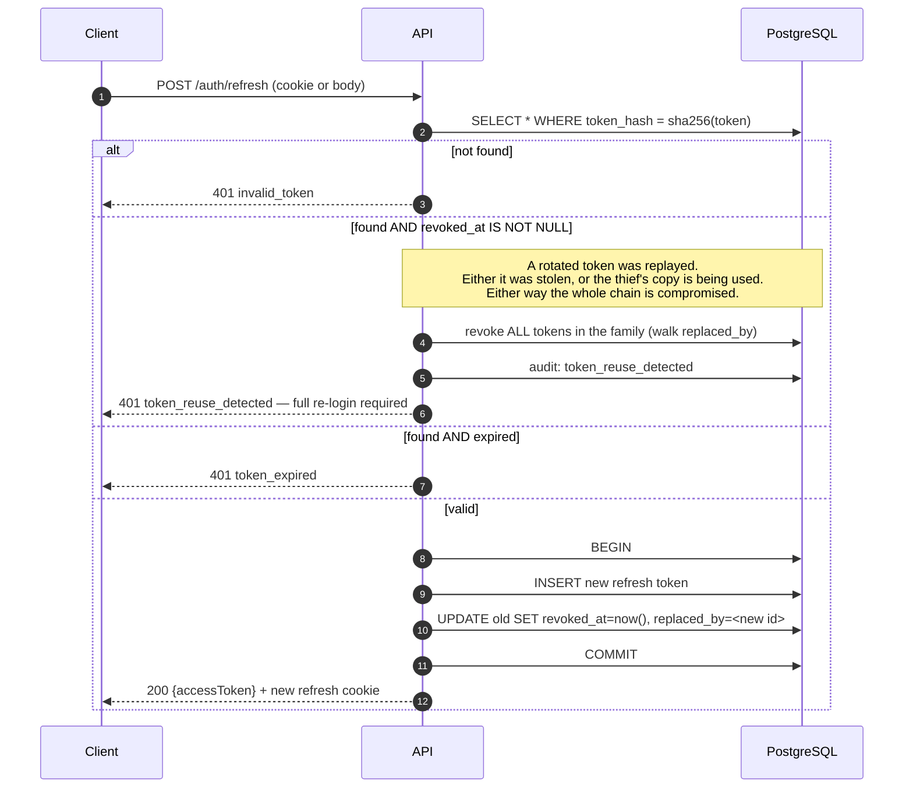
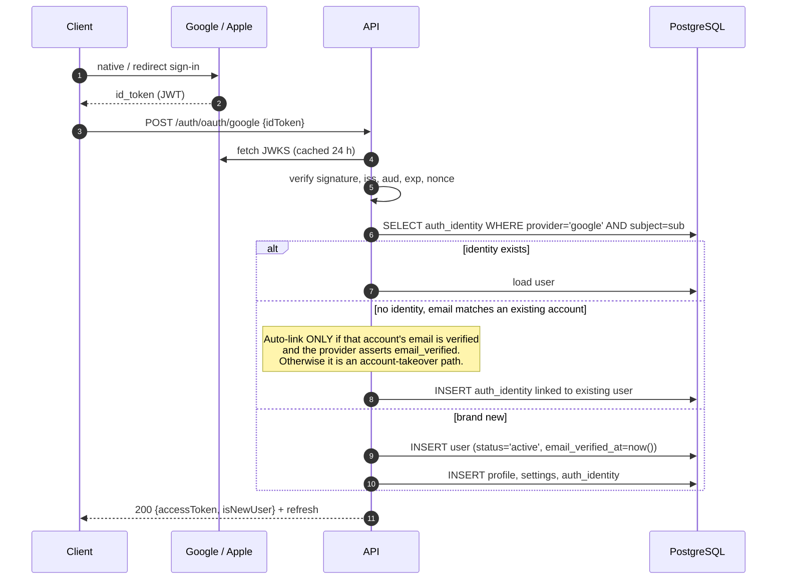
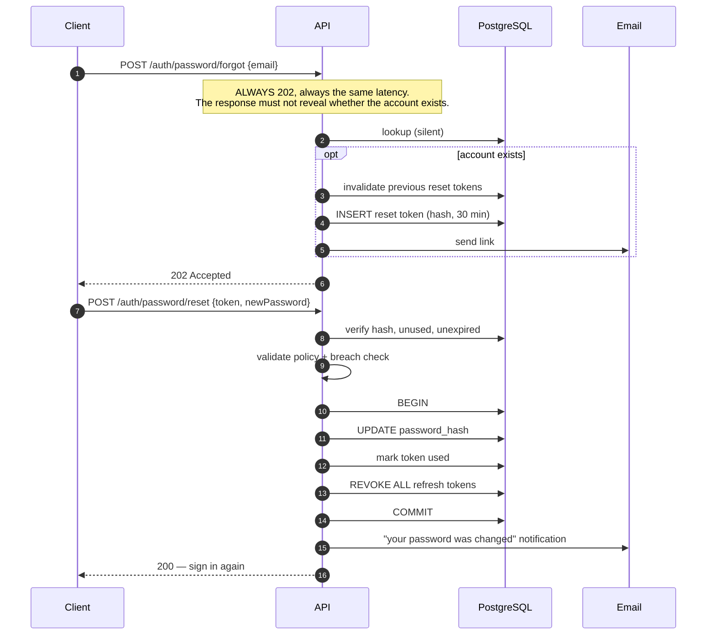

# 06 · Authentication & Authorization

---

## 1. Token model

| Token | Format | TTL | Stored where | Purpose |
|---|---|---|---|---|
| **Access** | JWT (HS256 → RS256 later) | 15 min | Memory (web) / SecureStore (mobile) | Bearer credential on every request |
| **Refresh** | 256-bit opaque random | 30 days, sliding | `httpOnly` cookie (web) / SecureStore (mobile) | Obtain a new access token |
| **Email verification** | 256-bit opaque | 24 h, single use | DB (SHA-256 hash) | Prove email ownership |
| **Password reset** | 256-bit opaque | 30 min, single use | DB (SHA-256 hash) | Reset without login |

**Why the refresh token is opaque, not a JWT.** A JWT cannot be revoked without a blocklist,
which defeats the point of statelessness. Refresh tokens must be revocable — on logout, on
password change, on theft detection — so they are random strings whose SHA-256 hash is a row in
`refresh_tokens`. Access tokens stay JWTs precisely because they are short-lived enough that
statelessness is safe.

**Why 15 minutes.** It bounds the damage of a leaked access token to 15 minutes without a
database lookup on every request. Immediate revocation still works through the Redis
`revoked:{jti}` set, which is checked on the auth hot path and holds entries only until natural
expiry.

### Access token claims

```json
{
  "sub": "0192f8e0-7b3a-7c4d-9e2f-1a2b3c4d5e6f",
  "jti": "0192f8e1-...",
  "typ": "access",
  "role": "user",
  "tier": "pro",
  "ev": true,
  "iat": 1785000000,
  "exp": 1785000900,
  "iss": "https://api.gympulse.app",
  "aud": "gympulse-client"
}
```

`role`, `tier` and `ev` (email verified) are embedded so routine authorisation needs no database
round-trip. They are **cached authority, not final authority**: anything that revokes access
immediately (suspension, downgrade, logout) also writes to Redis, and the auth dependency checks
it. A stale claim can therefore never outlive 15 minutes, and usually not even that.

**No PII in the token.** No email, no name. Tokens end up in logs, crash reports and proxy
caches.

---

## 2. Registration & email verification



**Pending users can sign in and use the app.** They cannot use the AI coach, social features or
anything that sends outbound email. Blocking the whole product behind a verification click is a
large, well-documented drop in activation; blocking only the abusable surfaces gets the security
benefit without it.

**Password policy:** minimum 10 characters, zxcvbn score ≥ 3, and rejected if present in the
Have I Been Pwned k-anonymity range check. No composition rules — no forced symbols, no forced
uppercase, no expiry. Those measurably produce *worse* passwords (NIST SP 800-63B agrees).

---

## 3. Login



Lockout is **per account, with a 15-minute window** — not permanent, because permanent lockout
on failed attempts is itself a denial-of-service vector against a known email address.

---

## 4. Refresh rotation & theft detection

The most security-sensitive flow in the system.



**Reuse detection is the entire point of rotation.** Without it, a stolen refresh token is a
permanent credential. With it, the moment either the legitimate client or the attacker uses a
token that has already been rotated, the whole family dies and the user is forced to re-login —
which is exactly the outcome you want.

**Race condition, handled:** a client that fires two refreshes concurrently (common when several
requests hit a 401 at once) would trip reuse detection. Two mitigations: a 10-second grace
window during which the immediately-preceding token returns the *same* new pair from a Redis
cache, and a client-side single-flight mutex so only one refresh is ever in flight.

### Where refresh tokens live

| Platform | Storage | Reasoning |
|---|---|---|
| **Web** | `httpOnly; Secure; SameSite=Lax` cookie, path-scoped to `/v1/auth/refresh` | Unreadable by JavaScript, so XSS cannot exfiltrate it. `SameSite=Lax` + a path scope means CSRF has almost no surface; the refresh endpoint additionally requires a double-submit CSRF token |
| **iOS / Android** | Expo SecureStore (Keychain / Keystore) | Hardware-backed, per-app sandboxed |
| **Access token** | In-memory only, never persisted | Persisting it to `localStorage` is the single most common auth mistake in SPAs |

---

## 5. Social sign-in (Google & Apple)



**Apple specifics that will bite you if ignored:**

- Apple returns the user's **name only on the very first authorisation**. Persist it then, or it
  is gone forever.
- "Hide My Email" gives a `@privaterelay.appleid.com` address. It is a real, deliverable address
  — but only if the sending domain is registered with Apple. Register it before launch or
  password resets to those users silently fail.
- The `sub` is stable per Apple Developer *Team*. Changing team ID orphans every account.
- Apple sends server-to-server notifications for account deletion and email changes. Implement
  the webhook or those users become ghosts.
- **App Store rule:** if the app offers any third-party sign-in, it must offer Sign in with
  Apple. This is a rejection, not a suggestion.

**ID token verification is done server-side, always.** The client passes the token; the server
verifies signature, issuer, audience and expiry against the cached JWKS. Trusting a client-side
verification result would let anyone forge a login with a crafted request.

---

## 6. Password reset



Revoking every session on reset is the point of the flow: if the reset happened *because* the
account was compromised, leaving the attacker's session alive makes it theatre.

---

## 7. Authorization model

Three layers, checked in this order:

### 7.1 Role (coarse)
`user` · `moderator` · `admin`. Route-level, via a dependency:

```python
@router.get("/admin/users", dependencies=[Depends(require_role("admin", "moderator"))])
```

### 7.2 Ownership (the one that matters)
Every user-owned resource is scoped by `user_id` **in the query**, not by a check after
loading:

```python
# Right: ownership is part of the predicate. A miss is a 404 and reveals nothing.
stmt = select(Model).where(Model.id == resource_id, Model.user_id == current_user.id)

# Wrong: loads someone else's row first, then hopes the check runs.
obj = await repo.get(resource_id)
if obj.user_id != current_user.id:
    raise ForbiddenError()
```

The repository interfaces in [05](05-backend-architecture.md) §3 have no signature that permits
the wrong version — `user_id` is a required parameter. This is IDOR (OWASP A01) prevention by
construction rather than by review.

### 7.3 Entitlement (tier)
```python
@router.post("/ai/plans/workout", dependencies=[Depends(require_entitlement("plan_generation"))])
```

`EntitlementService` resolves `subscriptions` + `feature_flags` into a capability set, cached
5 minutes. Features are named capabilities, never `if user.tier == "pro"` scattered through the
codebase — that pattern makes pricing changes a refactor.

### 7.4 Visibility (social)
Feed and profile reads apply a visibility predicate: `public`, or `followers` when a follow
exists, or the owner. **Progress photos are exempt from every visibility path** — they are
private, full stop, and are served only through short-lived signed URLs to their owner.

---

## 8. Session management

- `GET /auth/sessions` lists devices with last-seen, IP-derived location and user agent.
- `DELETE /auth/sessions/{id}` revokes one device.
- `POST /auth/logout-all` revokes everything and is offered in the "password changed" email.
- Suspicious-login detection (new country + new device) sends a notification with a one-click
  revoke-all link.

---

## 9. Client implementation notes

### Web
- Access token in a module-scoped variable inside the API client, never in `localStorage`.
- A response interceptor catches `401`, calls `/auth/refresh` behind a **single-flight promise**,
  and replays the queued requests once.
- Server Components read a short-lived session cookie for the initial render; the browser
  refreshes independently.
- Logout clears the cookie server-side (`Set-Cookie` with `Max-Age=0`) — a client-side delete of
  an `httpOnly` cookie is impossible by design.

### Mobile
- Tokens in `expo-secure-store`.
- Refresh proactively at 80 % of access-token lifetime while the app is foregrounded, so a lifter
  mid-set never hits a 401.
- On cold start with an expired access token, refresh **before** rendering the app shell, and
  keep the offline queue intact — the sync payload survives a failed refresh.
- Biometric re-authentication (`expo-local-authentication`) as an optional app lock. It gates the
  UI, not the tokens; it is a privacy feature, not an authentication factor.

---

## 10. Threat checklist

| Threat | Control |
|---|---|
| Credential stuffing | Per-IP+email rate limit, account lockout, breach-list rejection at registration and reset |
| Refresh token theft | Rotation + reuse detection + family revocation |
| XSS token exfiltration | `httpOnly` refresh cookie, in-memory access token, strict CSP |
| CSRF | `SameSite=Lax` + path-scoped cookie + double-submit token on the refresh endpoint |
| User enumeration | Identical responses and timing on register, login and forgot-password |
| Timing attack on login | Constant-time verify against a dummy hash for unknown emails |
| Session fixation | New token family issued on every login and on privilege change |
| JWT `alg=none` / confusion | Algorithm allow-list on decode; never trust the header |
| Token replay after logout | Redis `revoked:{jti}` checked on the auth path |
| Account takeover via OAuth | Auto-link only when both sides assert a verified email |
| Privilege escalation | Role and entitlement resolved server-side; claims treated as cache, not authority |

---

**Next:** [07 · Web Frontend](07-frontend-web.md)
