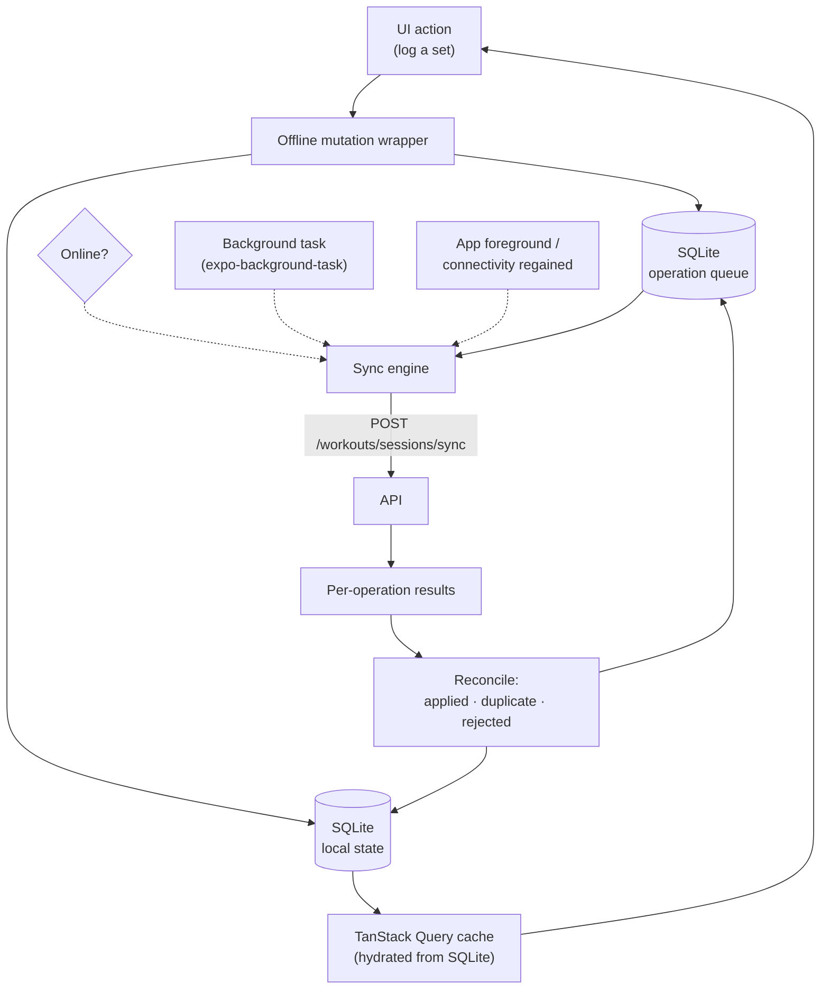

# 08 · Mobile Architecture

React Native · Expo (SDK 52+, dev client) · TypeScript · NativeWind · Expo Router ·
TanStack Query · Zustand · SQLite (offline WAL) · MMKV (fast key-value).

Mobile is not a port of the web app. **It is the primary product.** Nobody logs a bench press
from a laptop.

---

## 1. The constraint that drives everything: the gym

| Reality | Consequence |
|---|---|
| Basement gyms have no signal | **Every write works offline.** No exceptions |
| Hands are chalked, sweaty, shaking | Big targets, no precision gestures, no tiny steppers |
| The phone is used between sets, under time pressure | ≤ 2 taps to log a set. Screen must not require reading |
| The screen locks between sets | Rest timer must fire as a notification, and survive backgrounding |
| Sessions last 45–90 minutes | Battery discipline: no polling, no keep-awake unless requested |
| One hand is holding a dumbbell | Thumb-reachable bottom-anchored controls |

Every architectural choice below traces back to this table.

---

## 2. Expo, and why (with the honest trade-off)

**Managed workflow with a custom dev client (`expo-dev-client`), EAS Build, EAS Update.**

What it buys: one codebase, OTA updates for JS-only fixes (a logging bug reaches users in
minutes, not in a 3-day App Store review), managed native builds, and a very fast onboarding for
new developers.

What it costs: native modules must exist as Expo config plugins or be written as one, and OTA
updates cannot change native code. Both are acceptable — every native capability this app needs
(camera, barcode, secure store, notifications, health data, IAP) has a maintained plugin.

**Bare React Native is not chosen** because nothing here requires custom native work that Expo
cannot express, and the maintenance tax of managing Xcode/Gradle projects by hand is real.

---

## 3. Folder structure

```text
apps/mobile/
├── app/                              # Expo Router — file-based navigation
│   ├── _layout.tsx                   # root: providers, splash, auth gate, sync bootstrap
│   ├── (auth)/
│   │   ├── welcome.tsx  login.tsx  register.tsx  verify.tsx
│   ├── (onboarding)/
│   │   ├── goal.tsx  body.tsx  activity.tsx  experience.tsx  targets.tsx
│   ├── (tabs)/
│   │   ├── _layout.tsx               # 5 tabs; the centre one is the workout FAB
│   │   ├── index.tsx                 # Dashboard
│   │   ├── workouts.tsx
│   │   ├── log.tsx                   # centre action → start workout / quick add
│   │   ├── nutrition.tsx
│   │   └── profile.tsx
│   ├── workout/
│   │   ├── active.tsx                # ← the screen that matters most
│   │   ├── [id].tsx                  # session detail
│   │   ├── routine/[id].tsx
│   │   └── exercise-picker.tsx       # modal
│   ├── nutrition/
│   │   ├── search.tsx  barcode.tsx  food/[id].tsx  recipe/[id].tsx
│   ├── progress/
│   │   ├── weight.tsx  measurements.tsx  photos.tsx  compare.tsx
│   ├── coach/
│   │   ├── index.tsx                 # AI chat
│   │   └── report/[id].tsx
│   └── settings/…
│
├── src/
│   ├── features/                     # mirrors web: api/ components/ hooks/ stores/
│   │   ├── workouts/  nutrition/  progress/  coach/  auth/
│   ├── components/
│   │   ├── ui/                       # NativeWind primitives matching the design system
│   │   ├── charts/                   # victory-native (Skia)
│   │   └── layout/
│   ├── offline/                      # ← the heart of the mobile app
│   │   ├── database.ts               # expo-sqlite schema + migrations
│   │   ├── queue.ts                  # write-ahead operation log
│   │   ├── sync-engine.ts            # flush, backoff, conflict handling
│   │   ├── mutations.ts              # offline-aware mutation wrapper
│   │   └── conflict.ts
│   ├── lib/
│   │   ├── api/                      # same generated types as web
│   │   ├── auth/                     # SecureStore tokens, biometric lock
│   │   ├── notifications/            # scheduling, categories, handlers
│   │   ├── health/                   # HealthKit / Health Connect bridge
│   │   ├── haptics.ts  units.ts  storage.ts (MMKV)
│   └── stores/
├── assets/
├── app.json / app.config.ts          # plugins, permissions, build config
└── eas.json                          # build & submit profiles
```

---

## 4. Offline-first architecture



### 4.1 Local schema

```sql
-- The user's data, mirrored locally. This is what the UI reads from — always.
CREATE TABLE local_sessions (
    id TEXT PRIMARY KEY,            -- UUIDv7, generated on device
    payload TEXT NOT NULL,          -- JSON
    sync_state TEXT NOT NULL        -- 'local' | 'syncing' | 'synced' | 'conflict'
        CHECK (sync_state IN ('local','syncing','synced','conflict')),
    updated_at INTEGER NOT NULL
);
CREATE TABLE local_sets      (id TEXT PRIMARY KEY, session_id TEXT, payload TEXT, sync_state TEXT, updated_at INTEGER);
CREATE TABLE local_diary     (id TEXT PRIMARY KEY, local_date TEXT, payload TEXT, sync_state TEXT, updated_at INTEGER);

-- The write-ahead log. Append-only, ordered, drained by the sync engine.
CREATE TABLE operation_queue (
    op_id       TEXT PRIMARY KEY,   -- UUIDv7 = idempotency key
    type        TEXT NOT NULL,      -- 'set.log', 'session.complete', 'diary.create', …
    payload     TEXT NOT NULL,
    created_at  INTEGER NOT NULL,
    attempts    INTEGER NOT NULL DEFAULT 0,
    last_error  TEXT,
    next_attempt_at INTEGER NOT NULL DEFAULT 0
);
CREATE INDEX ix_queue_ready ON operation_queue (next_attempt_at, created_at);

-- Read-only reference data, cached so the exercise picker works offline.
CREATE TABLE cached_exercises (id TEXT PRIMARY KEY, payload TEXT, cached_at INTEGER);
CREATE TABLE cached_foods     (id TEXT PRIMARY KEY, payload TEXT, cached_at INTEGER);
```

### 4.2 The write path

```ts
// offline/mutations.ts
export async function logSetOffline(input: LogSetInput): Promise<LocalSet> {
  const id = uuidv7();                                  // the id the server will also use
  const set: LocalSet = { ...input, id, syncState: 'local', updatedAt: Date.now() };

  // One transaction: local state and the queue entry are written together or not at all.
  await db.withTransactionAsync(async () => {
    await db.runAsync(
      'INSERT INTO local_sets (id, session_id, payload, sync_state, updated_at) VALUES (?,?,?,?,?)',
      [id, input.sessionExerciseId, JSON.stringify(set), 'local', set.updatedAt],
    );
    await db.runAsync(
      'INSERT INTO operation_queue (op_id, type, payload, created_at, next_attempt_at) VALUES (?,?,?,?,0)',
      [uuidv7(), 'set.log', JSON.stringify(set), Date.now()],
    );
  });

  queryClient.setQueryData(workoutKeys.session(input.sessionId), (o) => addSet(o, set));
  syncEngine.requestFlush();                            // fire-and-forget; no await
  return set;                                           // UI already moved on
}
```

**The UI never awaits the network.** It awaits a local SQLite write — sub-millisecond — and the
sync engine deals with the rest. This is what makes logging feel instant in a basement.

### 4.3 The sync engine

```ts
class SyncEngine {
  private running = false;

  async flush(): Promise<void> {
    if (this.running || !(await isOnline())) return;
    this.running = true;
    try {
      // Bounded batches: a user returning from a week offline must not send one huge request.
      const ops = await this.dequeue(50);
      if (ops.length === 0) return;

      const { results } = await api.workouts.sync({ deviceId, operations: ops });

      for (const r of results) {
        switch (r.status) {
          case 'applied':
          case 'duplicate':                 // idempotency did its job; treat as success
            await this.markSynced(r.opId, r.result);
            break;
          case 'rejected':
            await this.handleRejection(r);  // surface to the user; never retry blindly
            break;
        }
      }
      if (await this.hasMore()) this.requestFlush();
    } catch (err) {
      await this.backoff(err);              // exponential, jittered, capped at 5 min
    } finally {
      this.running = false;
    }
  }
}
```

Triggers: app foreground, connectivity regained (`expo-network`), after every local write,
every 30 s while a workout is active, and from a periodic background task.

### 4.4 Conflict resolution

The conflict surface is genuinely small — a workout session is owned by one user and is
append-mostly — so the rules stay simple and predictable:

| Case | Resolution |
|---|---|
| Same set edited on two devices | Last write wins by `updatedAt`, **clamped to server time** so a device with a wrong clock cannot win |
| Set deleted on A, edited on B | Delete wins (tombstone) |
| Session completed on both | Idempotent: first wins, second returns `duplicate` with the same result |
| Diary entry duplicated | Deduplicated by client id |
| Server rejects (deleted exercise, quota) | Operation is dropped from the queue, the local row is flagged, and the user sees a specific, actionable message |

**Explicitly not using CRDTs.** They solve a harder problem than this app has, at a cost in
payload size, complexity and debuggability that would not repay itself.

---

## 5. The active workout screen

The single most important screen in the product.

```
┌─────────────────────────────────┐
│  Push Day A        00:42:15  ⋯  │  ← session timer, always visible
├─────────────────────────────────┤
│  Bench Press          ⓘ  ⋯      │
│  ┌───┬────────┬──────┬───┬───┐  │
│  │ # │  kg    │ reps │RPE│ ✓ │  │
│  ├───┼────────┼──────┼───┼───┤  │
│  │ W │  40    │  10  │   │ ✓ │  │  ← warm-up, excluded from volume & PRs
│  │ 1 │ 100    │   8  │ 8 │ ✓ │  │
│  │ 2 │ 100    │   8  │ 9 │ ✓ │  │
│  │ 3 │ 100    │  ▮   │   │ ○ │  │  ← focused; previous values pre-filled
│  └───┴────────┴──────┴───┴───┘  │
│  Last time: 3 × 8 @ 97.5 kg     │  ← the number the user actually wants
│  + Add set                      │
├─────────────────────────────────┤
│  Incline DB Press    (superset) │
├─────────────────────────────────┤
│      ⏱  Rest  1:28    [Skip]    │  ← sticky, thumb-reachable
│  ┌───────────────────────────┐  │
│  │      Finish Workout       │  │
│  └───────────────────────────┘  │
└─────────────────────────────────┘
```

Decisions behind it:

- **Every field is pre-filled from the last performance of that exercise.** The common case is
  "same as last time, maybe +2.5 kg", so the common case should be one tap on ✓.
- **A numeric keypad, not the system keyboard.** Custom weight/rep pads with ±2.5 kg and ±1 rep
  steppers. The system keyboard is slow, wrong, and covers the table.
- **Checking a set auto-starts the rest timer** at the exercise's configured rest, and fires a
  local notification when it ends — so the phone can be in a pocket.
- **Haptics on every completion**, a distinct pattern on a PR. Feedback without looking.
- **`expo-keep-awake` only while the active screen is foregrounded**, released on navigate away.
- **Swipe-to-delete a set requires confirmation.** Deleting a hard-earned set by accident is
  worse than one extra tap.
- The screen is fully functional with the network off, and shows a small "offline · 12 pending"
  chip rather than an error.

---

## 6. Native capabilities

| Capability | Package | Notes |
|---|---|---|
| Barcode scanning | `expo-camera` | Continuous scan, EAN-8/13/UPC. Debounced; haptic on hit. Falls back to manual entry |
| Progress photos | `expo-image-picker`, `expo-camera` | Ghost overlay of the previous photo for consistent framing. **EXIF stripped on device before upload** |
| Secure tokens | `expo-secure-store` | Keychain / Keystore |
| Biometric app lock | `expo-local-authentication` | Optional. Gates the UI, not the tokens |
| Push notifications | `expo-notifications` | Categories with actions ("Log now", "Snooze 10 min") |
| Background sync | `expo-background-task` | Opportunistic; iOS schedules at its own discretion — never the only sync path |
| Health data | `react-native-health` / Health Connect | Two-way weight and workout sync. P2 |
| Haptics | `expo-haptics` | Set complete, PR, error |
| In-app purchase | `react-native-purchases` (RevenueCat) | Cross-platform receipt handling; server-side validation remains authoritative |
| File export | `expo-file-system`, `expo-sharing` | Data export |

**Permissions are requested in context, never on launch.** Camera is requested when the user
taps "Scan barcode", with a sentence explaining why. Cold-start permission walls destroy grant
rates and, for the camera, App Store reviewers will ask.

---

## 7. Notifications

| Type | Timing | Rule |
|---|---|---|
| Rest timer | Exact, local | Scheduled locally so it fires with no network |
| Workout reminder | User-chosen time, local timezone | Suppressed if a workout was already logged today |
| Water reminder | Spread across waking hours | Suppressed once the daily goal is met |
| Protein reminder | Configurable, evening | Only if protein is below ~70 % of target |
| Weigh-in reminder | Morning, chosen days | |
| Weekly report | Monday morning, local | Push from the server, deep-links to the report |
| Streak at risk | Evening, only if the streak ≥ 3 days | Deliberately rare |
| Social | Real-time, batched | Off by default |

Rules that keep the app from being uninstalled: **quiet hours are respected absolutely**, no more
than 3 notifications per day by default, every type is individually toggleable, and every one
deep-links to the exact screen that resolves it. A notification that opens the home screen is a
bug.

Local notifications are used wherever possible (rest timer, reminders) so they work offline and
cost nothing.

---

## 8. Performance

| Concern | Approach |
|---|---|
| Long lists | `FlashList` (Shopify) with estimated item sizes — `FlatList` drops frames on the 600-exercise picker |
| Images | `expo-image` with `recyclingKey`, memory+disk cache, `contentFit` |
| Re-renders | Zustand selectors, `React.memo` on set rows, `useCallback` on row handlers |
| Animations | Reanimated 3 on the UI thread. Never `Animated` with `useNativeDriver: false` |
| Charts | `victory-native` on Skia — GPU-accelerated, unlike SVG-based alternatives |
| Cold start | Hermes, lazy route bundles, splash held only until auth + SQLite are ready. Target < 2 s on a mid-range Android |
| Bundle | `expo-atlas` audit each release; assets served from CDN, not bundled |
| Battery | No polling. Sync is event-driven. Keep-awake scoped to one screen |

---

## 9. Navigation

Expo Router (file-based, typed). Five tabs, with the centre tab acting as an action button
rather than a destination.

- **Deep links:** `gympulse://workout/{id}`, `gympulse://coach`, plus universal links
  (`https://gympulse.app/...`) so shared workouts open in the app.
- **Modals** for pickers and quick-add — presented as sheets, dismissible by gesture.
- **The active workout is protected**: navigating away keeps it running and shows a persistent
  "Workout in progress" banner that returns to it. Attempting to close the app mid-workout does
  not lose anything — it is already in SQLite.

---

## 10. Release process

| Change type | Channel | Latency |
|---|---|---|
| JS/TS only (bug fix, copy, layout) | **EAS Update** OTA | Minutes |
| Native module, permission, SDK upgrade | EAS Build → store review | 1–3 days |

- Channels: `development` → `preview` (internal + TestFlight) → `production`.
- **Staged OTA rollout**: 10 % → 50 % → 100 %, with automatic rollback on a crash-rate spike.
- Store compliance: privacy nutrition labels declaring health data collection, a
  `NSCameraUsageDescription` that explains *why*, Sign in with Apple present, IAP for
  subscriptions, and an in-app account-deletion path (an App Store requirement since 2022, and a
  common rejection cause).
- Sentry with native symbolication and source maps uploaded per build.

---

## 11. Code sharing between web and mobile

| Shared | Not shared |
|---|---|
| `packages/shared-types` — OpenAPI-generated types | UI components (NativeWind ≠ Tailwind DOM) |
| Zod validation schemas | Navigation |
| Unit conversion, date/timezone helpers | Storage layer |
| Business formatters (1RM, volume, macro maths) | Offline engine (mobile only) |
| Design tokens (colour, spacing, type scale) | Charts (Recharts vs Skia) |

**React Native Web is deliberately not used.** Sharing components between a mouse-driven desktop
app and a chalk-covered thumb-driven phone app produces something that is bad at both. Shared
*logic*, separate *presentation*.

---

**Next:** [09 · Design System](09-design-system.md)
