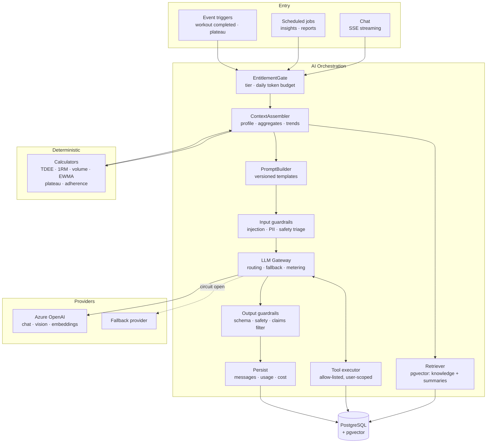
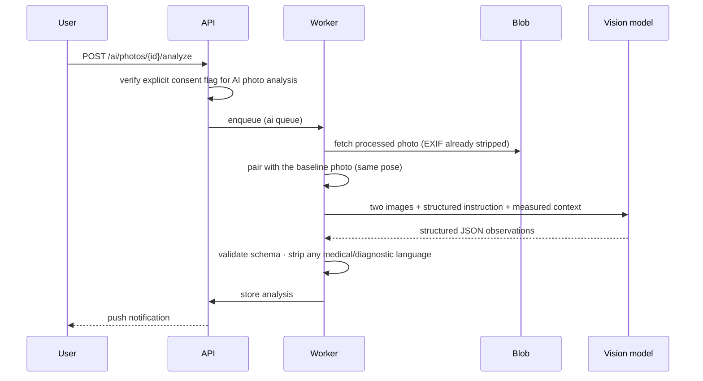

# 10 · AI Architecture

The AI coach is the product differentiator and its largest technical and ethical risk. This
document specifies how it works, what it is not allowed to do, and how we know it is behaving.

---

## 1. Design stance

Four commitments, each with an architectural consequence:

1. **Grounded, not generative.** The coach reasons over *this user's actual data*. It never
   invents a number. Facts come from tool calls against the database, not from the model's
   memory of the prompt.
2. **Deterministic where determinism is possible.** Calorie targets, 1RM estimates, volume
   totals, trend slopes and plateau detection are **computed in Python**, not by an LLM. The
   model interprets and explains those numbers; it does not produce them. An LLM that does
   arithmetic is a bug waiting to be reported.
3. **Bounded by hard constraints.** Safety floors live in the database and the service layer, so
   no prompt — adversarial, jailbroken or merely unlucky — can produce a dangerous target.
4. **Auditable.** Every call, every tool invocation, every token and every cost is recorded. When
   a user asks "why did it tell me that?", we can answer.

---

## 2. Component architecture



---

## 3. Context assembly

The coach's quality is decided here, not in the prompt wording.

### 3.1 What goes in

A compact, **pre-computed** bundle — under ~3,000 tokens, cached in Redis for 15 minutes:

```json
{
  "profile": {
    "age": 24, "gender": "male", "heightCm": 181, "experience": "intermediate",
    "activityLevel": "moderate", "goal": "lose_fat", "targetRateKgPerWeek": -0.45
  },
  "current": {
    "weightKg": 82.1, "trendWeightKg": 82.6, "trend30dKgPerWeek": -0.38,
    "targets": { "calories": 2450, "proteinG": 180, "carbsG": 240, "fatG": 68 }
  },
  "nutrition7d": {
    "avgCalories": 2610, "avgProteinG": 142, "daysLogged": 6,
    "adherencePct": 71, "avgCaloriesVsTarget": 160
  },
  "nutrition30d": { "avgCalories": 2520, "avgProteinG": 151, "daysLogged": 22 },
  "training7d": {
    "sessions": 4, "totalVolumeKg": 48200, "avgDurationMin": 62,
    "volumeByMuscleGroup": { "chest": 34, "back": 28, "legs": 12, "shoulders": 18, "arms": 22 }
  },
  "training30d": { "sessions": 15, "volumeTrendPct": 4.2, "consistencyPct": 88 },
  "recentPRs": [
    { "exercise": "Bench Press", "type": "est_1rm", "value": 126.7, "daysAgo": 5 }
  ],
  "stalledExercises": [
    { "exercise": "Barbell Squat", "weeksWithoutProgress": 5, "lastTopSet": "120kg x 5" }
  ],
  "flags": ["low_protein_adherence", "leg_volume_below_balance", "squat_plateau"]
}
```

Notes on what is deliberately **absent**: no raw set list, no diary line items, no free-text
notes, no photos. Those are available on demand via tools. Stuffing them into every prompt would
cost 20× the tokens and measurably *reduce* answer quality by burying the signal.

The `flags` array is produced by deterministic detectors, not by the model. It is how we ensure
the coach reliably notices the things that matter — a model asked to "spot problems" in a wall of
JSON misses them inconsistently.

### 3.2 Retrieval (RAG)

`pgvector`, HNSW index, cosine distance, `text-embedding-3-small` (1536 dims).

| Corpus | Scope | Content |
|---|---|---|
| **Knowledge base** | global (`owner_user_id IS NULL`) | ~2,000 curated chunks: exercise technique, progressive-overload principles, nutrition fundamentals, recovery, programme templates. **Sourced from named references and reviewed by a qualified professional** — not scraped |
| **Conversation summaries** | per user | Rolling summaries of older messages, so a long relationship stays coherent without unbounded context |
| **Exercise & food descriptions** | global | Improves grounding for "what's a good lat exercise with dumbbells?" |

**Every retrieval query filters on `owner_user_id`.** A missing filter here leaks one user's data
into another's coaching answer — the worst failure mode this system has. It is enforced in the
repository signature (the scope parameter is required) and covered by a dedicated test.

Retrieval is **not** used for the user's own numbers. Numbers come from tools. Vectors are for
prose.

---

## 4. Tool calling

The coach answers specifics by querying, not by remembering.

| Tool | Arguments | Returns |
|---|---|---|
| `get_exercise_history` | `exercise_name`, `weeks` | Sets, top set and volume per session |
| `get_nutrition_range` | `from`, `to` | Daily calories/macros and adherence |
| `get_workout_range` | `from`, `to` | Sessions with volume and duration |
| `get_body_metrics` | `metric`, `from`, `to` | Weight/measurement series with trend |
| `get_personal_records` | `exercise_name?` | Current PRs and progression chain |
| `search_exercises` | `muscle_group`, `equipment`, `difficulty` | Catalog matches |
| `search_foods` | `query`, `min_protein?` | Food matches with macros |
| `calculate_targets` | `goal`, `rate` | **Deterministic** TDEE/macro calculation |
| `propose_target_change` | `calories`, `protein`, `rationale` | Writes a *proposal* the user must accept |
| `create_workout_plan_draft` | structured plan | Writes a draft routine, never activates it |

Non-negotiable properties:

1. **Allow-listed.** The model cannot call anything not in this table. There is no
   "execute SQL" tool, ever.
2. **User-scoped by construction.** `user_id` is injected by the executor from the authenticated
   session — it is **not** a model-supplied argument. The model cannot address another user even
   if it tries.
3. **Read-mostly.** Only two tools write, and both write *proposals* requiring explicit user
   confirmation. The AI never silently changes a target or activates a plan.
4. **Argument-validated.** Pydantic schemas; invalid arguments return a structured error to the
   model rather than raising.
5. **Bounded.** Max 5 tool calls per turn, 10 s per call. Exceeding the budget ends the loop with
   a partial answer rather than spinning.
6. **Logged.** Every call lands in `ai_tool_calls` with arguments and result size.

---

## 5. Prompt architecture

Templates are **versioned files** (`prompts/coach_chat/v3.jinja`) with metadata: version, model,
owner, eval-suite reference, changelog. A prompt change is a code change — reviewed, tested and
deployable behind a flag. Prompts are never edited in a database or a config UI.

```jinja
{# prompts/coach_chat/v3.jinja — reviewed 2026-07 #}
You are the GymPulse coach. You help {{ profile.display_name }} train and eat better.

## What you are
An experienced, calm strength and nutrition coach. Direct, warm, specific. You talk like a
person, not a chatbot. Short paragraphs. No bullet-point walls unless asked for a list.

## What you know
The context below is this user's real data, computed from their logs. Trust it.
{{ context_json }}

## Rules you do not break
1. NEVER give medical advice, diagnose, or discuss medication, supplements beyond
   general nutrition, injury treatment, or disordered eating. Redirect to a qualified
   professional and say plainly that you are not one.
2. NEVER recommend a calorie target below {{ safety.calorie_floor }} kcal or a weekly
   weight-loss rate faster than 1% of bodyweight.
3. NEVER present an estimate as a fact. Body-fat figures, 1RM figures and photo
   observations are estimates. Say so.
4. If the numbers you need are not in the context above, CALL A TOOL. Do not guess,
   do not approximate, do not say "roughly".
5. Cite the user's own data when you make a claim: "your last four squat sessions
   were all 120 kg × 5" — not "your squat has stalled".
6. Recommend ONE change at a time. A user who is told to fix five things fixes none.

## Style
2–4 short paragraphs. Lead with the answer. No preamble, no "Great question!".
{{ locale_instruction }}
```

Prompt hygiene that matters: the user's message is passed as a **user turn**, never
concatenated into the system prompt; retrieved chunks are wrapped in delimiters and explicitly
labelled as reference material that may not issue instructions; and the context JSON is
data, not instructions — the template says so.

---

## 6. AI features in detail

### 6.1 Chat
Streaming SSE. Rolling summary keeps context bounded: messages older than the last 10 turns are
summarised into `ai_conversations.summary` by a cheap model, and the raw messages stay in the
database but leave the prompt.

### 6.2 Insights (async, event- and schedule-driven)

Detection is **deterministic**; the LLM only writes the copy.

| Insight | Detection rule (Python) |
|---|---|
| **Plateau** | No `est_1rm` improvement on an exercise for ≥ 4 weeks with ≥ 6 sessions logged |
| **Deficit mismatch** | 14-day average intake vs target diverges > 10 % while weight trend contradicts the stated goal |
| **Low protein** | 7-day average protein < 80 % of target |
| **Volume imbalance** | A muscle group < 40 % of its antagonist's weekly sets over 4 weeks |
| **Overreaching** | Weekly volume up > 30 % vs the 4-week average, with RPE trending up and session duration down |
| **Under-recovery** | ≥ 6 sessions in 7 days with no rest day |
| **Streak at risk** | Streak ≥ 3, nothing logged today, local time > 20:00 |

Splitting detection from generation is what makes insights *reliable*. The model's job is one
sentence of explanation and one concrete suggestion — a task it is genuinely good at.

### 6.3 Weekly & monthly reports
Scheduled per user timezone (Monday 06:00 local). Deterministic aggregation → structured JSON →
model writes the narrative → validated against a schema → stored → push notification. Generated
in the `ai` Celery queue, never in a request.

### 6.4 Plan generation
Constrained generation with a **hard validation pass**: the model proposes, then Python verifies
that every exercise id exists, weekly volume per muscle group falls in an evidence-based range,
session count matches the user's stated availability, equipment matches what the user has, and
progression is within safe bounds. Invalid plans are regenerated once, then fall back to a
template. **Generated plans always land as editable drafts** — the user reviews and accepts.

### 6.5 Vision — progress photo analysis

The highest-risk feature in the product. Gated accordingly.



Rules:

- **Separate, explicit, revocable opt-in.** Uploading a photo is not consent to have it analysed
  by a model. Two different decisions, two different toggles.
- **Comparative only.** The model compares two photos of the same pose and describes *visible
  change*. It never estimates body fat from an image alone — that is pseudo-precision, and users
  treat any percentage as fact.
- **Body-fat trend estimates** come from the Navy/Jackson-Pollock formulas over *measured*
  circumferences, and are always shown as a range with an explicit accuracy caveat. Never
  derived from a photo, never labelled as a medical measurement.
- **No aesthetic or moral judgement.** No "you look better", no "you've let things slip". The
  output describes change: "shoulder-to-waist ratio appears more pronounced than in week 1".
- **No minors.** Photo analysis is unavailable under 18, enforced on `date_of_birth`.
- **Never used for training.** Progress photos are excluded from any model-improvement pipeline,
  unconditionally, regardless of the account's general AI opt-in.
- Photos go to the vision endpoint over the Azure OpenAI private connection and are not retained
  by the provider (abuse-monitoring exemption requested and confirmed before launch).

---

## 7. Safety

This is a health-adjacent product used by young people. Safety is not a content filter bolted on
at the end.

### 7.1 Hard limits (enforced in code and schema, not in prompts)

| Limit | Value | Enforced at |
|---|---|---|
| Minimum calorie target | 1,500 male / 1,200 female | DB `CHECK` + service validation + prompt |
| Max weight-loss rate | 1 % bodyweight per week | Target calculation, clamped |
| Max weight-gain rate | 0.5 % bodyweight per week | Target calculation, clamped |
| Minimum body fat suggestion | Never suggests a body-fat target | Not implemented at all |
| Protein ceiling | 3 g/kg | Calculation clamp |
| Age floor | 13 to register; 18 for photo analysis | Registration + feature gate |

A prompt instruction can be argued with. A `CHECK` constraint cannot. **Every safety limit is
enforced at the lowest layer that can enforce it**, with the prompt as the outermost, weakest
ring.

### 7.2 Eating-disorder screening

An input triage classifier (small, cheap model + keyword heuristics) runs on every chat message
before the main call. Signals include: requests for extreme deficits, purging or fasting
language, weight targets below a healthy BMI for the user's height, body-image distress
language, and rapid escalation of restriction.

On a positive signal, the coach:
1. Does **not** answer the underlying request.
2. Responds with a short, non-clinical, non-judgemental message.
3. Surfaces region-appropriate support resources.
4. Logs the event as a safety flag — **without storing the message body** in analytics.

The user is never blocked from the app, never lectured, and never told they have a disorder.
This flow is written with, and reviewed by, a qualified professional before launch. It is not a
feature we ship on a hunch.

### 7.3 Medical boundary

The coach refuses and redirects on: injury diagnosis or treatment, pain beyond
"that's normal DOMS", medication, medical conditions (diabetes, thyroid, PCOS, hypertension,
pregnancy), supplements beyond ordinary food and protein powder, and anything involving blood
work.

Every AI surface carries a persistent, visible disclaimer. The onboarding flow states it once,
explicitly, and requires acknowledgement.

### 7.4 Prompt injection

The threat: a user's own free-text (exercise notes, custom food names, bio) is fed to a model
that has tools. Mitigations:

- Tools are allow-listed, read-mostly, and **scoped by server-injected `user_id`** — the worst
  case of a successful injection is the user reading their own data in a strange way.
- User content is delimited and labelled as untrusted data, never as instructions.
- Output guardrails reject responses containing tool-call syntax, system-prompt fragments, or
  attempts to alter the coach's role.
- Structured outputs are schema-validated; a malformed response is regenerated once, then falls
  back to a deterministic template.

### 7.5 Output filtering

Every response passes: JSON-schema validation (for structured features), a medical-claim
regex/classifier pass, a numeric sanity check (any calorie or weight figure the model emits is
range-checked against the user's data), and Azure Content Safety.

---

## 8. Evaluation

An AI feature without an evaluation suite is a feature nobody can safely change.

| Suite | Size | Gate |
|---|---|---|
| **Safety** | 150 adversarial cases: ED language, medical questions, injection attempts, minors, extreme requests | **100 % pass required. Blocks deploy.** |
| **Grounding** | 200 questions with known answers from seeded data | ≥ 95 % numerically correct; any hallucinated number is a failure |
| **Tool selection** | 100 questions requiring specific tools | ≥ 90 % correct tool chosen |
| **Insight precision** | 300 labelled user-histories | ≥ 85 % precision — a false plateau alert erodes trust fast |
| **Plan validity** | 100 generated plans | 100 % pass structural validation |
| **Tone** | 50 responses, rubric-scored | ≥ 4/5 on a human-reviewed rubric |
| **Regression** | Golden transcripts | Semantic diff reviewed on every prompt change |

Runs in CI on any change to a prompt, a tool, the context assembler or the model routing.
**Prompt version, model and eval-suite result are recorded with every deploy**, so a quality
regression can be traced to the change that caused it.

In production: thumbs up/down on every AI message with an optional reason, sampled human review
of 1 % of conversations (consented, redacted), and dashboards for refusal rate, tool-error rate,
p95 latency and cost per user.

---

## 9. Cost control

Unbounded LLM spend is how AI features get cancelled. Six mechanisms, in order of impact:

1. **Model routing by task class.** Classification and summarisation go to a small model; chat
   and reports to the frontier model. Roughly 60 % of calls are the cheap path.
2. **Pre-computed context.** Aggregates are computed in SQL, not by feeding raw rows to a model.
   This is the single largest saving — an order of magnitude on prompt tokens.
3. **Prompt caching.** The system prompt and knowledge chunks are stable across turns and cached
   provider-side.
4. **Rolling conversation summaries.** Context stays bounded no matter how long the relationship.
5. **Per-user budgets enforced before the call.** `ai_usage_logs` feeds a Redis counter; free
   tier gets 5 messages/day, Pro gets a generous but finite daily token budget. Exceeding it
   returns `402` with an upgrade path — never a surprise invoice.
6. **Async batching.** Weekly reports are generated in off-peak windows on the `ai` queue with a
   concurrency cap that respects the Azure OpenAI quota.

**Target: < €0.90 per Pro user per month**, tracked per feature in the cost dashboard. An alert
fires when the 7-day rolling cost per active user exceeds €1.20.

---

## 10. Failure modes

| Failure | Handling |
|---|---|
| Provider timeout | Retry once with backoff, then fail over to the secondary provider |
| All providers down | Circuit breaker opens; chat returns a clear "coach is unavailable" message; scheduled jobs retry with backoff for up to 6 hours |
| Rate limit from provider | Token-bucket throttle on the `ai` queue; user-facing chat is prioritised over batch jobs |
| Malformed structured output | Regenerate once with the schema error appended, then fall back to a deterministic template |
| Content filter triggered | Return a neutral message; log for review; never expose the filter category to the user |
| Tool error | Return a structured error to the model, which explains the gap honestly rather than inventing data |
| Cost spike | Automatic per-user throttle at 3× the expected daily budget, alert to on-call |

**The coach being unavailable never blocks logging.** Every core feature — workouts, diary,
weight, photos — works with the AI layer completely down. That separation is deliberate and is
tested.

---

## 11. Privacy

- **Training opt-out is the default.** `user_settings.ai_training_opt_in` defaults to `false`.
  No user data leaves for model improvement without an explicit, revocable opt-in.
- **Progress photos are never used for training**, regardless of that setting.
- Azure OpenAI is deployed in the same region as the data, over a private endpoint, with the
  zero-retention configuration confirmed in writing before launch.
- AI message bodies are **excluded from application logs by default** and redacted in analytics.
- Admin access to conversation contents requires a step-up authentication, is limited to
  moderation and abuse investigation, and is itself audited.
- Deleting a conversation deletes its messages and its derived embeddings — verified by a test,
  because orphaned embeddings are an easy and invisible leak.

---

**Next:** [11 · Security](11-security.md)
