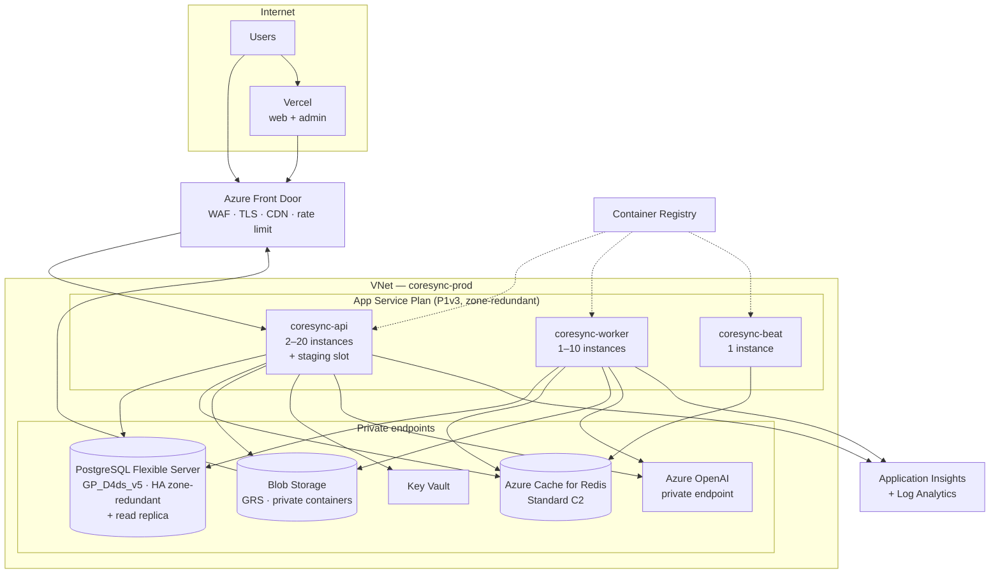

# 12 · DevOps & Deployment

---

## 1. Environments

| Env | Purpose | Infrastructure | Data |
|---|---|---|---|
| **local** | Development | Docker Compose | Seeded fixtures |
| **ci** | Automated tests | Ephemeral containers (testcontainers) | Generated per run |
| **staging** | Pre-production verification | Azure, production-shaped but smaller | Anonymised subset |
| **production** | Live | Azure, zone-redundant | Real |

Staging mirrors production's *topology* — same services, same private endpoints, same
deployment mechanism — at a smaller SKU. A staging environment that differs structurally proves
nothing.

**Production data is never copied to a lower environment.** Staging is seeded by a generator that
produces realistic volumes with synthetic identities.

---

## 2. Containers

```dockerfile
# docker/api.Dockerfile
FROM python:3.12-slim AS base
ENV PYTHONUNBUFFERED=1 PYTHONDONTWRITEBYTECODE=1 PIP_NO_CACHE_DIR=1
WORKDIR /app
RUN apt-get update && apt-get install -y --no-install-recommends \
        build-essential libpq-dev curl && rm -rf /var/lib/apt/lists/*

# ---- dependency layer: cached unless the lockfile changes ----
FROM base AS deps
COPY backend/pyproject.toml backend/uv.lock ./
RUN pip install uv && uv sync --frozen --no-dev

FROM deps AS development
RUN uv sync --frozen                       # includes dev dependencies
COPY backend/ .
CMD ["uvicorn", "coresync.presentation.main:app", "--host", "0.0.0.0", "--reload"]

# ---- production: minimal, non-root, read-only ----
FROM base AS production
RUN groupadd -r app && useradd -r -g app -u 10001 app
COPY --from=deps /app/.venv /app/.venv
ENV PATH="/app/.venv/bin:$PATH"
COPY --chown=app:app backend/src ./src
COPY --chown=app:app backend/migrations ./migrations
COPY --chown=app:app backend/alembic.ini ./
USER app
EXPOSE 8000
HEALTHCHECK --interval=30s --timeout=3s --start-period=20s --retries=3 \
    CMD curl -fsS http://localhost:8000/v1/health || exit 1
CMD ["gunicorn", "coresync.presentation.main:app", \
     "-k", "uvicorn.workers.UvicornWorker", \
     "-w", "4", "-b", "0.0.0.0:8000", \
     "--timeout", "60", "--graceful-timeout", "30", "--max-requests", "10000", \
     "--max-requests-jitter", "1000", "--access-logfile", "-"]
```

Notes: multi-stage keeps the production image at roughly a quarter of the naive size; the
dependency layer is cached separately so a code change rebuilds in seconds; `--max-requests`
with jitter recycles workers to bound any slow memory growth without a synchronised restart
stampede; running as UID 10001 with a read-only root filesystem is enforced at the platform
level too.

Worker and beat containers reuse the same image with a different command — one image, one build,
no drift between what the API runs and what the workers run.

---

## 3. CI/CD

```mermaid
graph LR
    PR["Pull request"] --> LINT["Lint & types<br/>ruff · mypy · eslint · tsc"]
    LINT --> UNIT["Unit tests"]
    UNIT --> INT["Integration tests<br/>(testcontainers Postgres+Redis)"]
    INT --> API_T["API contract tests<br/>+ schemathesis"]
    API_T --> SEC["Security<br/>semgrep · pip-audit · trivy · gitleaks"]
    SEC --> ARCH["Architecture<br/>import-linter"]
    ARCH --> BUILD["Build images"]
    BUILD --> E2E["E2E on ephemeral env"]
    E2E --> OK{"All green?"}
    OK -->|no| BLOCK["Blocked"]
    OK -->|yes| MERGE["Merge to main"]

    MERGE --> STG["Deploy → staging<br/>migrate · smoke · perf"]
    STG --> GATE{"Manual approval"}
    GATE --> PROD["Deploy → production<br/>slot swap"]
    PROD --> VERIFY["Health + smoke<br/>15-min error-budget watch"]
    VERIFY -->|regression| RB["Auto-rollback<br/>(swap back)"]
```



### 3.1 Pipeline layout

```yaml
# .github/workflows/api-ci.yml (abridged)
name: API CI
on:
  pull_request:
    paths: ['backend/**', '.github/workflows/api-ci.yml']

concurrency:
  group: api-ci-${{ github.ref }}
  cancel-in-progress: true          # a new push supersedes an in-flight run

jobs:
  quality:
    runs-on: ubuntu-latest
    steps:
      - uses: actions/checkout@v4
      - uses: astral-sh/setup-uv@v3
      - run: uv sync --frozen
      - run: uv run ruff check . && uv run ruff format --check .
      - run: uv run mypy src/coresync/domain src/coresync/application --strict
      - run: uv run lint-imports          # Clean Architecture contracts

  test:
    runs-on: ubuntu-latest
    services:
      postgres:
        image: pgvector/pgvector:pg16
        env: { POSTGRES_PASSWORD: test, POSTGRES_DB: test }
        options: >-
          --health-cmd pg_isready --health-interval 5s --health-retries 10
      redis:
        image: redis:7-alpine
    steps:
      - uses: actions/checkout@v4
      - uses: astral-sh/setup-uv@v3
      - run: uv sync --frozen
      - run: uv run alembic upgrade head
      - run: uv run pytest -n auto --cov=coresync --cov-report=xml --cov-fail-under=80
      - run: uv run pytest tests/contract --schemathesis

  security:
    runs-on: ubuntu-latest
    permissions: { security-events: write }
    steps:
      - uses: actions/checkout@v4
      - uses: gitleaks/gitleaks-action@v2
      - run: uv run pip-audit --strict
      - uses: returntocorp/semgrep-action@v1
      - uses: aquasecurity/trivy-action@master
        with: { scan-type: fs, severity: 'HIGH,CRITICAL', exit-code: '1' }

  openapi:
    runs-on: ubuntu-latest
    steps:
      - run: uv run python -m coresync.cli export-openapi > openapi.json
      - run: npx oasdiff breaking origin-openapi.json openapi.json   # fails on breaking change
      - run: npx openapi-typescript openapi.json -o frontend/src/lib/api-types/api.ts
      - name: Fail if generated types are stale
        run: git diff --exit-code frontend/src/lib/api-types/
```

### 3.2 Deployment workflow

```yaml
# .github/workflows/api-deploy.yml (abridged)
on:
  push: { branches: [main], paths: ['backend/**'] }

jobs:
  build:
    steps:
      - uses: azure/login@v2
        with: { client-id: ${{ vars.AZURE_CLIENT_ID }},      # OIDC federation
                tenant-id: ${{ vars.AZURE_TENANT_ID }},      # no stored credentials
                subscription-id: ${{ vars.AZURE_SUBSCRIPTION_ID }} }
      - run: az acr build -r coresync -t api:${{ github.sha }} -f docker/api.Dockerfile .

  migrate:
    needs: build
    environment: production
    steps:
      # Migrations run ONCE, from a job — never from application startup, which would
      # race across every replica during a rolling deploy.
      - run: |
          az containerapp job start -n coresync-migrate -g coresync-prod \
            --image coresync.azurecr.io/api:${{ github.sha }} \
            --command "alembic upgrade head"

  deploy:
    needs: migrate
    steps:
      - run: az webapp config container set -n coresync-api -g coresync-prod \
               --slot staging --docker-custom-image-name coresync.azurecr.io/api:${{ github.sha }}
      - run: ./scripts/wait-healthy.sh https://coresync-api-staging.azurewebsites.net
      - run: ./scripts/smoke-test.sh https://coresync-api-staging.azurewebsites.net
      - run: az webapp deployment slot swap -n coresync-api -g coresync-prod --slot staging
      - run: ./scripts/watch-error-budget.sh 15m   # auto-swaps back on regression
```

**Federated OIDC credentials, not stored secrets.** GitHub authenticates to Azure with a
short-lived token bound to the repository and branch — there is no long-lived service-principal
secret to leak.

### 3.3 Migration & deploy ordering

The rule that prevents most deploy incidents: **schema changes must be backwards-compatible with
the currently running code**, because during a slot swap both versions run simultaneously.

| Change | Procedure |
|---|---|
| Add a column | Migrate first, deploy second. Safe |
| Drop a column | Deploy code that stops using it → **then** migrate in the *next* release |
| Rename a column | Expand/migrate/contract across three releases. Never a single `ALTER` |
| Add an index | `CREATE INDEX CONCURRENTLY`, outside a transaction |
| Add `NOT NULL` | Add nullable → backfill in batches → `CHECK NOT VALID` → `VALIDATE` → set `NOT NULL` |
| Backfill data | A resumable, throttled Celery task — never an Alembic script |

---

## 4. Azure topology



### Resource sizing at launch

| Resource | SKU | Monthly (est.) | Scales by |
|---|---|---|---|
| App Service Plan | P1v3 (2 vCPU, 8 GB), zone-redundant | ~€230 | CPU > 65 %, p95 latency, queue depth |
| PostgreSQL Flexible | GP_D4ds_v5, 256 GB, HA | ~€480 | Storage, IOPS, then replicas |
| Read replica | GP_D2ds_v5 | ~€180 | Added at ~50k MAU |
| Redis | Standard C2 (2.5 GB) | ~€100 | Memory, ops/sec |
| Blob (GRS) | ~2 TB + egress | ~€90 | Photo volume |
| Front Door | Standard + WAF | ~€60 | Traffic |
| Azure OpenAI | PAYG | Variable | Capped by budget ([10](10-ai-architecture.md) §9) |
| App Insights | 20 GB/mo, sampled | ~€50 | Sampling rate |
| **Total** | | **~€1,200/mo** | |

> **App Service vs Container Apps.** App Service is specified and is the right call for launch:
> deployment slots, a simple operational model, predictable cost. Its weakness is worker scaling
> — KEDA queue-depth autoscaling is native to Container Apps and awkward on App Service. The
> planned path is to move the **workers** to Container Apps when AI and media queues start
> driving cost (roughly Phase 6), keeping the API on App Service. The container image is
> identical, so the migration is configuration, not code.

Infrastructure is defined in Bicep under `scripts/azure/bicep/` — modules per resource, parameter files
per environment, deployed by pipeline. No resource is created in the portal; anything created by
hand is deleted by the next deployment, which is the point.

---

## 5. Configuration & secrets

| Kind | Storage | Example |
|---|---|---|
| Non-secret config | App Service application settings (Bicep) | `ENVIRONMENT`, `LOG_LEVEL` |
| Secrets | Key Vault, referenced by App Service | `@Microsoft.KeyVault(SecretUri=...)` |
| Service auth | Managed identity | Postgres, Blob, Key Vault, OpenAI |
| Build-time | GitHub OIDC + repository variables | Azure subscription ids |

`Settings` is validated at startup; a missing or malformed value stops the process rather than
producing a runtime failure on the first request that needs it. Secret rotation is a Key Vault
version bump plus a restart — no redeploy, no code change.

---

## 6. Observability

### Three signals, one correlation id

Every request generates (or accepts) `X-Request-Id`, which appears in every log line, every span
and every error report — so a user's bug report links to the exact trace.

| Signal | Tool | Content |
|---|---|---|
| **Logs** | structlog → Application Insights | Structured JSON, PII-redacted, request/user/route/duration |
| **Traces** | OpenTelemetry | FastAPI, SQLAlchemy, Redis, httpx auto-instrumented; custom spans for LLM calls with model, tokens and cost as attributes |
| **Metrics** | App Insights + custom | RED (rate/errors/duration) per endpoint, queue depth, DB pool utilisation, cache hit rate, AI cost/latency |

### Dashboards

1. **Service health** — RPS, error rate, p50/p95/p99 by endpoint, instance count.
2. **Database** — connections, slow queries (`pg_stat_statements`), replication lag, cache hit
   ratio, table and index bloat.
3. **Queues** — depth and age per queue, task duration, failure and retry rates.
4. **AI** — calls, tokens, cost per feature/model/day, latency, refusal rate, safety flags.
5. **Business** — signups, activation, workouts and diary entries logged, DAU/MAU, conversion.

### Alerts (page vs ticket)

| Condition | Action |
|---|---|
| Error rate > 2 % for 5 min | **Page** |
| p95 latency > 1 s for 10 min | **Page** |
| Health check failing on ≥ 2 instances | **Page** |
| DB connections > 80 % of max | **Page** |
| Replication lag > 30 s | **Page** |
| Refresh-token reuse spike | **Page** (security) |
| Queue depth > 1,000 for 15 min | Ticket |
| Celery task failure rate > 5 % | Ticket |
| Disk > 80 % | Ticket |
| AI cost > 3× baseline | Ticket |
| Certificate expiring < 14 days | Ticket |

Alerts are tuned to be *actionable*. An alert that fires without a runbook and a decision is
noise, and noise is how real alerts get ignored.

---

## 7. Backup & disaster recovery

| Target | Value |
|---|---|
| **RPO** | 5 minutes (Postgres PITR) |
| **RTO** | 1 hour (same region) / 4 hours (cross-region) |

- **Postgres:** automated backups, 35-day retention, point-in-time restore, geo-redundant.
- **Blob:** GRS with soft delete (30 days) and versioning on the photo containers — a bug that
  deletes photos must be recoverable.
- **Redis:** treated as disposable. Nothing that cannot be rebuilt lives there. The Celery broker
  is the exception, mitigated by `acks_late` and idempotent tasks.
- **Infrastructure:** reproducible from Bicep in under an hour.

**Restore is tested quarterly** by actually restoring into a scratch environment and running the
smoke suite against it. An untested backup is a belief, not a backup.

**DR scenarios with rehearsed runbooks:** region outage (restore geo-backup into the paired
region, repoint Front Door), accidental mass deletion (PITR to just before the event), corrupted
deploy (slot swap back — under a minute), ransomware or credential compromise (rotate everything,
restore from an immutable backup).

---

## 8. Release management

- **Trunk-based development.** Short-lived branches, merged to `main` behind feature flags.
  Long-lived branches are how integration pain is manufactured.
- **Feature flags** for anything user-visible, with percentage rollout keyed on a hash of
  `user_id` so a user's experience is stable.
- **Deploy cadence:** continuous to staging, daily to production during business hours. No
  Friday-afternoon deploys — not superstition, just staffing.
- **Mobile:** JS-only changes ship via EAS Update within minutes at a staged 10 → 50 → 100 %;
  native changes go through store review.
- **Versioning:** CalVer for apps (`2026.7.1`), SemVer for the API.
- **Rollback:** slot swap for the API (< 1 minute), EAS Update revert for mobile, Vercel instant
  rollback for web. Every deploy is rollback-tested in staging before it reaches production.

---

**Next:** [13 · Testing Strategy](13-testing-strategy.md)
