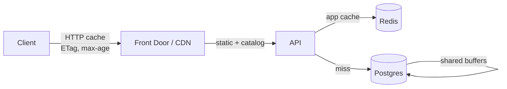

# 14 · Scalability & Operations

"Scalable to millions of users" is not a switch. It is a sequence of bottlenecks, each with a
known symptom and a known response. This document names them in the order they will actually
arrive, so nobody over-engineers stage 5 while stuck at stage 1.

---

## 1. Workload characteristics

Knowing the shape of the load matters more than knowing its size.

| Property | Value | Consequence |
|---|---|---|
| Read : write ratio | ~8 : 1 | Caching and read replicas pay off early |
| Peak concentration | 06:00–09:00 and 17:00–21:00 local | 3–4× average; global spread flattens it |
| Data per active user | ~8 MB/year (+ ~50 MB photos) | Storage grows linearly and predictably |
| Hottest write | Log a set — small, frequent, bursty | Must stay sub-100 ms; offline-tolerant |
| Hottest read | Diary for a date, active session | Single-user, index-friendly, cacheable |
| Most expensive op | AI chat and reports | Async, metered, budgeted |
| Tenancy | Single-user scoped | **Almost everything shards cleanly by `user_id`** |

That last row is the most important fact in this document. There are no cross-user transactions
in the core product. When horizontal partitioning eventually becomes necessary, `user_id` is a
natural shard key and the application already scopes every query by it.

---

## 2. Growth stages

### Stage 1 — 0 to 10k MAU
**Shape:** ~5 rps average, ~25 rps peak. Database under 20 GB.

Nothing special is required. 2 API instances, 1 worker, a single Postgres instance, small Redis.
Cost ~€1,200/month ([12](12-devops-deployment.md) §4).

*The only real work at this stage is instrumentation.* Get RED metrics, slow-query logging and
per-endpoint latency budgets in place now, so the next stage is diagnosed rather than guessed.

---

### Stage 2 — 10k to 100k MAU
**Symptoms:** p95 creeping up; dashboard queries appearing in `pg_stat_statements`; connection
count climbing.

| Action | Why |
|---|---|
| **Add the read replica** and route reports, admin analytics and AI context assembly to it | These are the heavy, latency-tolerant queries. Never route read-after-write paths there |
| **Redis caching on the hot reads** — `/users/me`, exercise catalog, dashboard overview, food search | Cuts DB load by a large fraction for near-zero effort |
| **Autoscale API 2 → 8** on CPU and p95 | |
| **Verify the aggregate tables are doing their job** | Dashboards must never scan raw logs ([03](03-database-schema.md) §9) |
| **PgBouncer** (transaction mode) once instance count × pool size approaches `max_connections` | Postgres connections are expensive; this is the first hard ceiling most teams hit |

Cost roughly €2,500–4,000/month.

---

### Stage 3 — 100k to 500k MAU
**Symptoms:** table sizes in the hundreds of millions of rows; autovacuum falling behind; food
search latency rising; AI cost becoming a line item that matters.

| Action | Why |
|---|---|
| **Partition the big tables** — `session_sets`, `diary_entries`, `ai_messages`, `ai_usage_logs` | Monthly `RANGE` partitioning. Designed for since day one, so this is a migration and not a redesign ([03](03-database-schema.md) §12) |
| **Second read replica**, split analytics from user-facing reads | One noisy report should not slow the coach |
| **Move workers to Container Apps with KEDA** queue-depth scaling | AI and media queues are bursty; App Service scaling is the wrong instrument |
| **CDN everything static** — exercise media, thumbnails, catalog JSON | Cuts egress cost and improves cold-start feel worldwide |
| **Tune autovacuum per table** on the high-churn ones | Default settings are wrong at this row count; bloat is a slow, silent outage |
| **Materialise the social feed** for users with many follows | Fan-out on read stops working somewhere around here |

Cost roughly €8,000–15,000/month.

---

### Stage 4 — 500k to 2M MAU
**Symptoms:** a single primary is the bottleneck for writes; Postgres is doing too many jobs at
once.

| Action | Why |
|---|---|
| **Extract the AI service** — the first and most obvious module to split off | Different scaling profile (slow, expensive, bursty), different failure domain, different deploy cadence. ADR-001 anticipated this |
| **Dedicated search** (OpenSearch) if food search p95 exceeds 200 ms with correct indexing | Only when measured. `pg_trgm` + FTS goes a long way |
| **Analytics off OLTP** — CDC into ClickHouse or Synapse | Business analytics and OLTP have incompatible access patterns |
| **Vector store split** if `ai_embeddings` exceeds ~10 M rows with degrading recall | pgvector HNSW is good, not infinite |
| **Multi-region read** for latency, primary still single-region | Write latency is tolerable; read latency is felt |

---

### Stage 5 — 2M+ MAU
**The `user_id` shard key finally gets used.**

- Horizontal partitioning of user data across Postgres clusters (Citus, or application-level
  routing through a directory service).
- Regional write locality — EU users write to the EU cluster.
- Full event-driven decomposition where it genuinely earns its keep.
- Dedicated teams per domain, which is the real reason to split services at this point.

**This stage is deliberately vague.** Designing it now would be fiction — the actual bottleneck
will be visible from stage 4's metrics, and the correct move will be obvious then. What matters
is that nothing in stages 1–3 forecloses it: UUID keys, user-scoped queries, stateless API,
no cross-user transactions.

---

## 3. Caching

| Layer | Holds | Invalidation |
|---|---|---|
| Client | Reference data, own catalog copy | ETag / version |
| CDN | Media, static assets, public catalog | Purge on publish |
| Redis | User auth view, dashboard, food search, AI context, entitlements | **Event-driven** — the write path deletes the key |
| Postgres buffers | Hot indexes and pages | — |

**Invalidation is event-driven, never TTL-hopeful.** The use case that completes a workout
deletes `user:{id}:summary:*` inside the same unit of work. TTLs exist as a backstop for bugs,
not as the mechanism.

**Cache-key discipline:** every key is namespaced and versioned
(`v3:user:{id}:dashboard:{date}`). A schema change bumps the version prefix, which invalidates
an entire class atomically without a scan.

**Stampede protection:** single-flight locks around expensive regeneration, plus jittered TTLs.
Without it, a popular cache expiring at a round number takes the database down at exactly the
worst moment.

---

## 4. Database operations

| Practice | Detail |
|---|---|
| **Connection pooling** | Per-instance SQLAlchemy pool sized against the global budget; PgBouncer in transaction mode from stage 2 |
| **Statement timeout** | 15 s globally, 5 s on user-facing reads. An unbounded query is an outage waiting for traffic |
| **`pg_stat_statements`** | Reviewed weekly. Top-20 by total time is the work queue for optimisation |
| **Autovacuum** | Tuned per table; aggressive on `session_sets`, `diary_entries`, `refresh_tokens` |
| **Index hygiene** | `pg_stat_user_indexes` quarterly — unused indexes are dropped, they cost write throughput |
| **Bloat monitoring** | Alert at 30 % on the hot tables |
| **Long transactions** | Alerted above 30 s — they block vacuum and hold locks |
| **Replication lag** | Alerted above 30 s; the replica router falls back to the primary automatically |

---

## 5. Service level objectives

| SLO | Target | Error budget (30 d) |
|---|---|---|
| API availability | 99.9 % | 43 min |
| Log-a-set p95 | < 150 ms | |
| Diary read p95 | < 200 ms | |
| Dashboard p95 | < 300 ms | |
| Food search p95 | < 150 ms | |
| AI first token p95 | < 2.5 s | |
| Sync success rate | > 99.5 % | |
| Data durability | 100 % | zero tolerance |

**The error budget governs release behaviour.** Budget healthy → ship features. Budget below
25 % → reliability work only until it recovers. This is the mechanism that stops "we'll fix
reliability later" from being true forever.

**Explicitly excluded from the availability SLO:** the AI coach. It is a degradable feature by
design — the core product works completely without it ([10](10-ai-architecture.md) §10), and
holding it to the same bar would either slow feature work or produce dishonest numbers.

---

## 6. On-call

- **Follow-the-sun is not viable** at this team size. One primary on-call, one secondary,
  weekly rotation, compensated.
- **Every alert has a runbook.** An alert without a documented decision is deleted or downgraded
  to a ticket.
- **Escalation:** primary (5 min) → secondary (10 min) → engineering lead.
- **Blameless post-mortems** within 5 working days for SEV1/SEV2, with action items assigned and
  tracked to completion. A post-mortem with no owned actions is theatre.

### Core runbooks

| Runbook | Trigger | First action |
|---|---|---|
| API latency spike | p95 > 1 s | Check DB slow queries → connection pool → recent deploy → scale out |
| Database CPU high | > 80 % | `pg_stat_activity` for long queries → kill offenders → check for a missing index from the last release |
| Queue backlog | depth > 1,000 | Check worker health → scale workers → look for a poison message |
| AI unavailable | circuit open | Verify provider status → confirm fallback engaged → post status page notice |
| Sync failures rising | > 1 % | Check API errors → check the mobile release → check for a schema/version mismatch |
| Storage costs spiking | > 3× baseline | Audit upload volume → check the orphan reaper → check for abuse |
| Deploy regression | error budget watch fires | Slot-swap back immediately, diagnose afterwards |

---

## 7. Cost model

| MAU | Infrastructure | AI | Total | Per MAU |
|---|---|---|---|---|
| 10k | €1,200 | €150 | €1,350 | €0.135 |
| 100k | €3,500 | €1,200 | €4,700 | €0.047 |
| 500k | €12,000 | €5,000 | €17,000 | €0.034 |
| 2M | €40,000 | €18,000 | €58,000 | €0.029 |

Cost per user falls with scale, as it should. At a 5 % conversion rate to €7.99/month, gross
margin stays above 85 % throughout — which is what makes the AI feature affordable rather than
existential.

**Cost controls that matter, in order of impact:**

1. AI token budgets and model routing ([10](10-ai-architecture.md) §9) — the largest variable
   cost and the one most likely to surprise.
2. Blob lifecycle policies — progress photos move to Cool tier after 90 days, Archive after 1
   year. Users rarely view photos older than a few months, and the price difference is an order
   of magnitude.
3. Reserved instances for the steady-state baseline; autoscale on top for peaks.
4. Application Insights sampling (10 % of successful requests, 100 % of errors) — observability
   bills grow faster than traffic if left unsampled.
5. Egress via CDN rather than direct from Blob.

**Cost is a monitored metric with alerts**, not a monthly surprise: per-feature AI cost, cost per
active user, and a 3× daily-baseline alarm.

---

## 8. Capacity planning

Review monthly against these leading indicators:

| Indicator | Threshold | Action |
|---|---|---|
| DB CPU sustained | > 60 % | Plan a scale-up or replica |
| DB storage | > 70 % | Grow storage (irreversible on Azure — plan ahead) |
| Connection utilisation | > 70 % | PgBouncer or pool tuning |
| Redis memory | > 70 % | Scale up or tighten TTLs |
| p95 latency trend | +20 % month-over-month | Profile before it becomes an incident |
| Queue age p95 | > 60 s | Add workers |
| Cost per MAU | rising | Investigate — it should fall |

Azure Postgres storage **cannot be reduced** once increased. Grow it deliberately, in planned
steps, not reactively at 95 % on a Saturday.

---

## 9. Data lifecycle at scale

| Data | Growth | Management |
|---|---|---|
| `session_sets` | ~1,500 rows/user/year | Partition monthly; keep forever (it is the user's asset) |
| `diary_entries` | ~1,800 rows/user/year | Partition monthly; keep forever |
| Progress photos | ~50 MB/user/year | Lifecycle: Hot → Cool (90 d) → Archive (1 y) |
| `ai_messages` | ~500 rows/user/year | Summarise and purge after 24 months |
| `ai_usage_logs` | ~1,000 rows/user/year | Drop partitions after 13 months |
| `admin_audit_logs` | low | Archive to Blob after 2 years |

The principle: **user-generated training and nutrition history is never expired.** It is the
reason people stay — a five-year lifting history is switching-cost that no competitor can copy.
Everything else has a retention policy.

---

**Next:** [15 · Roadmap](15-roadmap.md)
