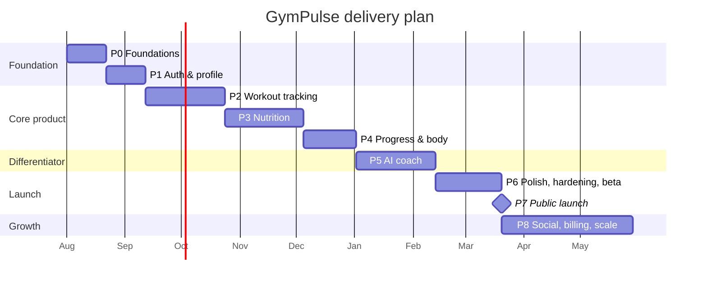

# 15 · Roadmap & Development Phases

---

## 1. Reality check

The full scope in [01](01-product-and-scope.md) is four products in one. Delivered properly it is
**12–18 months for a team of 5–8**. Attempting it as a single big-bang release is the most
reliable way to ship nothing.

The plan below is therefore ordered by one principle: **each phase is independently valuable and
independently shippable.** If funding, time or appetite runs out after Phase 4, what exists is a
real, usable product — not a half-built one.

### Team shape

| Role | Phases 0–3 | Phases 4–8 |
|---|---|---|
| Backend engineer | 2 | 2–3 |
| Mobile engineer | 1 | 2 |
| Web engineer | 1 | 1–2 |
| Designer | 0.5 | 1 |
| AI/ML engineer | 0.5 | 1 |
| DevOps | 0.5 (shared) | 1 |
| Product / QA | 0.5 | 1 |

**Solo-developer path:** the same order, roughly 3× the calendar time, and cut Phases 7–8
entirely. Phases 0–5 alone are a credible product.

---

## 2. Phase overview

---

## Phase 0 — Foundations *(3 weeks)*

**Goal:** a developer clones the repo, runs one command, and has a working stack with CI green.

| Deliverable | Detail |
|---|---|
| Monorepo | Turborepo, workspace config, shared eslint/tsconfig/tailwind presets |
| Backend skeleton | FastAPI app factory, Clean Architecture folders, config, logging, error handling, health endpoints |
| Database | Postgres + pgvector, Alembic, the core identity tables, seed CLI |
| Docker Compose | api, worker, beat, postgres, redis, minio, mailhog, web |
| CI | Lint, types, tests, import-linter, security scans, coverage gate |
| Azure infra (Bicep) | Staging environment provisioned end to end |
| Design tokens | Colour, type, spacing, radius shared by web and mobile |
| Web + mobile shells | Routing, providers, theming, a "hello" screen deployed |

**Exit criteria:** `docker compose up` works from a clean machine · CI green on a PR · staging
reachable · an engineer can ship a trivial change to staging in under 30 minutes.

> Do not skip this phase to "start on features". Every week saved here costs three later.

---

## Phase 1 — Authentication & profile *(3 weeks)*

| Deliverable | Detail |
|---|---|
| Auth | Register, verify email, login, refresh rotation with reuse detection, logout, password reset ([06](06-authentication.md)) |
| Social login | Google + Apple, account linking rules |
| Profile & settings | Full profile, units, theme, language, privacy |
| Targets | TDEE calculator, macro split, temporal versioning, manual override |
| Onboarding | 5-step flow ending with computed targets |
| Entitlements | Tier/capability service (all free for now, but the seam exists) |
| GDPR | Data export and account deletion — **built now, not retrofitted** |
| Security | Rate limiting, security headers, IDOR test suite |

**Exit criteria:** a user can register on all three clients, complete onboarding, see their
targets, export their data and delete their account. Security scans clean.

---

## Phase 2 — Workout tracking *(6 weeks)* ← the heart

| Deliverable | Detail |
|---|---|
| Exercise catalog | 600+ seeded exercises with muscles, equipment, difficulty, instructions, images |
| Routines | Create, edit, reorder, folders, duplicate, starter templates |
| Live session | Start, log sets, rest timer, session timer, notes, discard, complete |
| Set types | Normal, warm-up, drop, failure, AMRAP; superset grouping |
| PR detection | Max weight, max reps, max volume, estimated 1RM, progression chain |
| History | List, detail, calendar heatmap, per-exercise history |
| **Offline-first mobile** | SQLite WAL, sync engine, conflict resolution, `/sync` endpoint |
| Aggregates | `daily_activity_summaries`, `exercise_statistics`, streaks |

**Exit criteria:** log a complete workout in airplane mode on a real phone, in a real gym, and
have it sync correctly · ≤ 2 taps per set · PR celebration fires · sync suite green including
kill-mid-flush.

> **Validate this phase with real lifters before moving on.** Put it in front of ten people for
> two weeks. If logging is not faster than Hevy, fix it now — no amount of AI compensates for a
> slow logger.

---

## Phase 3 — Nutrition *(6 weeks)*

| Deliverable | Detail |
|---|---|
| Food database | ~15k curated verified foods + USDA reference import + Open Food Facts pipeline with trust tiers |
| Search | Trigram + FTS, ranked by recents → favourites → verified → popular. p95 < 150 ms |
| Diary | Four meals, quick-add, edit, copy day/meal, daily totals vs targets |
| Custom foods | Create, edit, private scoping |
| Water | Logging and goal |
| Barcode | Camera scanning with OFF fallback and local cache (mobile) |
| Micronutrients | Full nutrient model, food detail screen |
| Recipes | Multi-ingredient, per-serving macros, log N servings |
| Aggregates | `daily_nutrition_summaries`, nutrition streaks |
| Moderation | Admin queue for user-submitted foods |

**Exit criteria:** log a full realistic day in under 3 minutes · barcode scan succeeds on 20 real
supermarket products · search latency budget met under load.

> **Food data quality is the make-or-break risk of this phase.** Budget real time for curating
> the verified core set. A fast app with wrong calories is worthless.

---

## Phase 4 — Progress & body *(4 weeks)*

| Deliverable | Detail |
|---|---|
| Weight | Log, EWMA trend, chart with raw dots + trend line |
| Measurements | 10 sites, history, per-site charts |
| Progress photos | Direct-to-blob upload, EXIF strip, thumbnails, timeline, pose grouping |
| Comparison | Side-by-side with dates and weight deltas |
| Statistics | Volume by muscle group, PR list, frequency, adherence |
| Dashboard | The full stat-tile + chart dashboard from [09](09-design-system.md) |
| Charts | Shared chart layer with the validated palette, both themes, table fallback |

**Exit criteria:** six months of seeded data renders correctly in every chart · photo upload
strips EXIF verifiably · dashboard p95 within budget · a11y pass on all charts.

---

## Phase 5 — AI coach *(6 weeks)* ← the differentiator

| Deliverable | Detail |
|---|---|
| LLM gateway | Provider abstraction, routing, fallback, circuit breaker, usage metering |
| Context assembler | Pre-computed bundle, Redis-cached, deterministic detectors |
| Tools | The 10 allow-listed, user-scoped tools |
| Chat | SSE streaming, conversation threads, rolling summaries |
| RAG | pgvector knowledge base (professionally reviewed), scoped retrieval |
| Insights | Plateau, deficit mismatch, low protein, imbalance, overreaching, streak risk |
| Weekly reports | Scheduled per timezone, push-notified |
| Safety | Calorie floors (schema + service), ED triage, medical boundary, injection defence |
| **Eval suite** | All six suites from [10](10-ai-architecture.md) §8, wired into CI |
| Cost control | Budgets, routing, caching, dashboards, alerts |

**Exit criteria:** **safety suite at 100 %** · grounding ≥ 95 % · cost per test user within
budget · coach unavailability provably does not break any core feature.

> The safety gate is not negotiable and not deferrable. A fitness AI that recommends an unsafe
> deficit to a 16-year-old is an existential event for the company, not a bug.

---

## Phase 6 — Polish, hardening & beta *(5 weeks)*

| Deliverable | Detail |
|---|---|
| Notifications | All types, timezone-aware, quiet hours, outbox dispatcher, deep links |
| Achievements | Definitions, evaluation worker, unlock UX |
| Admin panel | Users, exercises, food moderation, AI logs (redacted), announcements, flags |
| Performance | Load testing to stage-2 volumes, query-count budgets, bundle budgets |
| Accessibility | Full audit, VoiceOver and TalkBack passes, contrast verification |
| i18n | EN + EL, all strings externalised |
| **External pen test** | All High findings closed |
| Store submission | Privacy labels, screenshots, review notes, Apple Sign-In verified |
| Closed beta | 200–500 users, 3 weeks, instrumented |

**Exit criteria:** pen test clean · crash-free sessions > 99.5 % · beta D7 retention > 30 % ·
store builds approved · all [11](11-security.md) §12 checklist items ticked.

---

## Phase 7 — Public launch *(milestone)*

Staged rollout by region. Status page live. On-call rota staffed. Error budgets being tracked
from day one. Support queue with defined SLAs. Marketing site and App Store presence live.

**Do not launch with billing.** Launch free, prove retention, then monetise in Phase 8. A paywall
on an unproven retention curve just suppresses the data you need.

---

## Phase 8 — Growth *(10 weeks, parallelisable)*

| Track | Deliverables |
|---|---|
| **Monetisation** | Subscriptions via RevenueCat (IAP) + Stripe (web), receipt validation, paywall, trial, entitlement enforcement |
| **Social** | Follows, feed, likes, comments, moderation |
| **AI expansion** | Plan generation, meal plans, monthly reports, photo analysis (behind its own safety gate) |
| **Integrations** | Apple Health, Health Connect, smart scales |
| **Scale** | Read replica, partitioning prep, workers to Container Apps ([14](14-scalability-and-operations.md) §2) |
| **Retention** | Onboarding experiments, streak mechanics, re-engagement campaigns |

---

## 3. Estimation summary

| Phase | Duration | Cumulative | Ship-worthy? |
|---|---|---|---|
| 0 Foundations | 3 w | 3 w | No |
| 1 Auth & profile | 3 w | 6 w | No |
| 2 Workouts | 6 w | 12 w | **Yes — a real workout tracker** |
| 3 Nutrition | 6 w | 18 w | **Yes — tracker + diary** |
| 4 Progress | 4 w | 22 w | **Yes — a complete tracking app** |
| 5 AI coach | 6 w | 28 w | **Yes — the actual product** |
| 6 Hardening | 5 w | 33 w | Launch-ready |
| 7 Launch | — | 33 w | Live |
| 8 Growth | 10 w | 43 w | Monetised |

**~8 months to launch, ~10 to a monetised product**, at the team size above. Add 30–40 % buffer;
every estimate in this table is optimistic, as all estimates are.

---

## 4. Risk register

| Risk | P | Impact | Mitigation |
|---|---|---|---|
| Scope creep | **High** | Fatal | Phase gates. Nothing enters a phase after it starts. New ideas go to the backlog, without exception |
| Food data quality | High | Fatal | Dedicated curation budget in Phase 3; trust tiers; visible verified badges; moderation queue |
| Logging UX not fast enough | Medium | Fatal | Real-gym validation at the end of Phase 2, before anything else is built on top |
| AI safety incident | Low | Existential | Schema-level limits, eval gate at 100 %, professional review, ED triage |
| AI cost overrun | Medium | High | Budgets enforced pre-call, routing, caching, alerting |
| App Store rejection | Medium | Delay | Apple Sign-In, IAP, in-app deletion, no medical claims — all designed in from Phase 1 |
| Offline sync data loss | Medium | Fatal | Heaviest-tested component in the codebase; kill-mid-flush tests |
| Key-person dependency | Medium | High | Documentation (this set), pairing, no single-owner modules |
| Postgres bottleneck earlier than expected | Low | Medium | Stage-2 actions are pre-planned and cheap |
| Competitor ships the same AI | Medium | Medium | The moat is the *data* and the switching cost of years of history, not the model |

---

## 5. Best practices (the ones that will actually be violated)

Every team knows these. These are the ones that erode first under deadline pressure, so they are
stated explicitly.

### Engineering
1. **Small PRs.** Under ~400 lines. A 2,000-line PR is not reviewed, it is approved.
2. **Trunk-based with feature flags.** Long-lived branches manufacture integration pain.
3. **Tests in the same PR as the code.** "We'll add tests later" is never true.
4. **Never merge with CI red**, and never disable a check to unblock a release.
5. **Migrations are backwards-compatible.** Expand/migrate/contract, always.
6. **Log structurally, never `print`.** Never log PII.
7. **Errors carry codes**, not just messages. Clients branch on codes.
8. **No `TODO` without a ticket number.**
9. **Document decisions, not code.** An ADR explains *why*; the code shows *what*.

### Architecture
10. **The dependency rule is enforced by CI**, not by good intentions ([05](05-backend-architecture.md) §9).
11. **Business logic in the domain layer.** Not in routers, not in ORM models, not in components.
12. **Every repository read is user-scoped by signature.** Security by construction.
13. **Anything slow or expensive is async.** No LLM call, image processing or report generation
    in a request path.
14. **Cache invalidation is event-driven**, with TTL as a backstop only.
15. **Idempotency keys on every creating POST.** Mobile networks retry.

### Product
16. **Ship a phase, learn, then build the next.** Do not build Phase 5 while Phase 2 is unproven.
17. **Instrument before optimising.** Every performance decision needs a measurement.
18. **Nothing user-visible ships without a designer's eyes on it.**
19. **Accessibility is a merge gate**, not a backlog item.
20. **Never shame the user.** It is the fastest way to lose them.

### Data & safety
21. **Historical records snapshot their values.** A diary entry from March must not change when a
    food is corrected in July.
22. **Safety limits live in the schema.** Prompts and services are additional rings, not the ring.
23. **User training data is never expired.** It is the moat.
24. **Erasure is tested by an all-tables integration test.** Anything less is a claim, not a
    guarantee.

---

## 6. Production readiness — the honest list

Before charging anyone money:

**Reliability** — health checks · graceful shutdown · retries with backoff and jitter · circuit
breakers on every external dependency · idempotency · rate limits · timeouts on **every** network
call (the most common omission) · bulkheads between the AI path and core paths.

**Observability** — structured logs with correlation ids · distributed traces · RED metrics per
endpoint · business dashboards · actionable alerts with runbooks · error budgets tracked.

**Security** — external pen test passed · secrets in Key Vault · IDOR suite green · TLS and
headers verified by test · dependency scanning blocking · erasure and export verified.

**Operations** — restore tested by actually restoring · rollback tested in staging · on-call
staffed · runbooks written for every alert · status page · post-mortem process defined ·
capacity reviewed monthly.

**Compliance** — privacy policy, ToS and sub-processor list published · DPIA for AI and photos ·
consent flows reviewed by counsel · store privacy labels accurate · breach-notification templates
pre-written.

**The single most common gap in projects of this shape:** an untested backup and an unrehearsed
restore. Test it in Phase 6, and quarterly thereafter.

---

## 7. What to do first

1. Read [01](01-product-and-scope.md) and [02](02-system-architecture.md) end to end. Disagree
   with anything in writing now, while disagreement is free.
2. Execute Phase 0 exactly as specified. Resist starting features.
3. Build Phase 2 and put it in a real gym in front of real lifters before building anything else.
4. Let what you learn there reshape Phases 3–8. This plan is a hypothesis, not a contract.

---

*End of the architecture set. Back to the [README](../README.md).*
